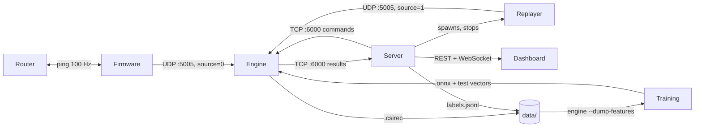

# WiFi Sensing — Code Plan

This document explains what has to be built, in which order and why, so that
at the end one ESP32-S3 and our router produce presence, motion, breathing,
person count, posture and fall alerts on a dashboard with Home, School and
Clinic profiles.

How to read it:

- **Sections 1–3** describe the system: the parts, how data moves between
  them, and the exact formats they use to talk to each other.
- **Section 4** is the build order. Each step says why it exists, what to
  build, and a check that proves it works.
- **Section 5** says which recordings the models need.
- **Section 6** says what each profile does.
- **Section 7** is the checklist for "the system works".
- **Section 8** explains what this plan gives you, what it depends on, and
  what to expect from each output.

## 1. Components

| Component | Folder | Language | Does |
|---|---|---|---|
| Firmware | `firmware/` | C (ESP-IDF) | Pings the router at 100 Hz, captures CSI, sends frames over UDP |
| csirec library | `tools/csirec/` | C | Reads and writes `.csirec` files; used by every tool and the engine |
| recorder | `tools/recorder/` | C | UDP → `.csirec`, standalone capture |
| replayer | `tools/replayer/` | C | `.csirec` → UDP, stands in for the ESP32 |
| serial-bridge | `tools/serial-bridge/` | C | USB serial → UDP, fallback transport |
| Engine | `engine/` | C++ | Parses frames, DSP, ONNX inference, rules, records, sends results |
| Server | `server/` | Java 21, Spring Boot | Talks to the engine, REST + WebSocket, history, alerts, profiles, labelling |
| Scripts | `scripts/` | shell / Python | `run_all`, `fake-engine`, `check_session`, `onsite_adapt`, latency report |
| Models | `ml/` | Python | Generates synthetic training data, trains M1 and M2, exports ONNX + test vectors, fine-tunes on site |
| Dashboard | `ui/` | Next.js, TypeScript | Home / School / Clinic pages, labelling screen, alerts |

**What CSI is, briefly.** Every Wi-Fi packet carries a known training
pattern. The receiver measures how each of the 52 subcarriers (small
frequency slices of the channel) arrived: its amplitude and phase. A person in
the room reflects and blocks part of the signal, so their position, movement
and even chest motion from breathing change those amplitudes. The ESP32
reports this measurement (Channel State Information) for every packet it
receives from the router. Pinging the router 100 times a second gives 100
measurements a second.

## 2. Data flow



At runtime:

1. The firmware sends one UDP packet per CSI measurement to the engine.
2. The engine buffers the measurements, cleans them, runs the DSP and the
   models every 0.5 s, applies the rules and sends one JSON result line to the
   server.
3. The server stores the results, turns events into alerts according to the
   active profile and pushes everything to the dashboard over WebSocket.

Offline:

4. During a labelled session the engine writes the raw frames to a `.csirec`
   file and the server writes the labels to `labels.jsonl`.
5. Training reads the engine's preprocessed features (not the raw file) plus
   the labels, trains the models and exports them as ONNX.
6. The engine loads the ONNX files.

Three design rules hold everywhere, and each one prevents a specific class of
bug:

- **The engine is the only place where CSI is preprocessed.** If Python
  re-implemented the same steps, small differences would make the models see
  different data in training and at runtime, and nothing would report it.
- **`.csirec` and `labels.jsonl` use the same clock: host wall-clock µs.**
  The ESP32 clock counts from boot and resets on every reboot, so labels made
  in the browser could never be matched to ESP32 timestamps.
- **The replayer sends exactly the same packets as the ESP32.**
  The engine does not know or care where frames come from, so every part of
  the system can be developed and demonstrated from recordings.

All binary formats are little-endian (ESP32 and x86 both are).

## 3. Interfaces

These files live in `contracts/` and are written before the code that uses
them. They are the only places where two parts of the system touch, so as
long as each side follows its contract, the parts can be built in parallel.

### 3.1 `contracts/csi_frame.h` (firmware → engine)

One UDP packet = one header + the raw CSI values.

```c
#define CSI_MAGIC   0x31495343u   /* "CSI1" */
#define CSI_VERSION 1

#pragma pack(push, 1)
typedef struct {
  uint32_t magic;
  uint16_t version;            /* CSI_VERSION */
  uint16_t hdr_len;            /* sizeof(csi_frame_hdr_t) */
  uint8_t  node_id;
  uint8_t  source;             /* 0 live, 1 replay */
  uint8_t  sig_mode;           /* 0 non-HT, 1 HT */
  uint8_t  mcs;
  uint8_t  cwb;                /* 0 = 20 MHz, 1 = 40 MHz */
  uint8_t  stbc;
  uint8_t  first_word_invalid;
  uint8_t  gain_valid;         /* 1 if agc_gain / fft_gain are filled */
  uint8_t  agc_gain;
  int8_t   fft_gain;
  int8_t   rssi_dbm;
  int8_t   noise_floor_dbm;
  uint8_t  channel;
  uint8_t  secondary_channel;
  uint8_t  src_mac[6];         /* router MAC */
  uint32_t boot_id;            /* random per boot; ts_us and seq reset with it */
  uint64_t ts_us;              /* esp_timer, time since boot */
  uint32_t seq;
  uint16_t n_values;           /* int8 values that follow */
} csi_frame_hdr_t;
#pragma pack(pop)

#ifdef __cplusplus
static_assert(sizeof(csi_frame_hdr_t) == 46, "csi_frame_hdr_t size");
#else
_Static_assert(sizeof(csi_frame_hdr_t) == 46, "csi_frame_hdr_t size");
#endif

/* followed by int8_t data[n_values]: [imag, real] pairs per subcarrier,
   exactly as ESP-IDF wifi_csi_info_t.buf delivers them (no compensation). */
```

Why these fields:

- `sig_mode`, `cwb`, `stbc` tell the engine how the raw values are laid out.
  The router sends different packet types (pings are HT, beacons are not), and
  each type puts the subcarriers in a different place. Without these fields
  the engine would mix layouts.
- `agc_gain`, `fft_gain`: the ESP32 changes its receiver gain automatically,
  which shifts all amplitudes up or down. The engine undoes that. The firmware
  sends raw values, so old recordings stay usable if the compensation changes.
- `boot_id`, `seq`: `seq` detects lost packets; a new `boot_id` tells the
  engine the ESP32 rebooted and its timestamps restarted.
- `hdr_len`, `version`: let readers detect format changes instead of reading
  garbage.

### 3.2 `contracts/recording.md` (engine / recorder → training)

```
.csirec file header:  char magic[4] = "CSIR"; uint16 version = 1; uint16 reserved = 0
each record:          uint32 len; uint64 host_rx_us; uint8 frame[len]
```

`host_rx_us` is the laptop time when the packet arrived. It is the timestamp
labels are matched against.

`labels.jsonl`, written by the server in the same host µs clock:

```json
{"kind":"segment","session":"s03","t_start_us":1767225600123456,"t_end_us":1767225660123456,"label":"sitting","count":1,"subject":"alex","layout":"L1"}
{"kind":"mark","session":"s03","t_press_us":1767225700456789,"event":"fall"}
```

- A **segment** says "from this time to that time, this was happening".
- A **mark** says "this happened at this moment" (for example a fall). It
  stores the raw button-press time; the training loader shifts it to account
  for human reaction time (about 0.4 s late).

### 3.3 `contracts/results.schema.json` (engine → server, every 0.5 s)

```json
{
  "type": "result", "v": 1,
  "ts": 1767225600123, "t_rx_last_us": 1767225600118000,
  "node": 1, "boot_id": 2913411, "source": "live",
  "rate_hz": 98.5, "loss": 0.012, "dropped_layout": 0,
  "calibration": {"state": "ok", "age_s": 312},
  "presence": true,
  "count":   {"value": 1, "p": [0.04, 0.91, 0.05], "src": "model"},
  "posture": {"label": "lying", "p": 0.87, "src": "model"},
  "motion": 0.03,
  "breathing": {"bpm": 14.2, "confidence": 0.81, "valid": true,
                "wave": [0.12, 0.18, 0.21, 0.17, 0.09]},
  "csi": [[0.4, 0.5, "... 52 values"], "... 5 rows"],
  "events": [{"id": 42, "type": "fall", "t": 1767225600100}]
}
```

| Field | Meaning |
|---|---|
| `ts` | laptop time of the end of this window, ms |
| `t_rx_last_us` | receive time of the newest frame in the window; used to measure latency |
| `source` | `live` or `replay`; the UI shows a banner when it is not `live` |
| `rate_hz`, `loss` | health of the stream: frames per second and share of lost packets |
| `calibration.state` | `none`, `running`, `ok` |
| `count`, `posture` | model outputs with probabilities; `src` is `model` or `rule` (fallback) |
| `posture` | `null` when nobody is present |
| `breathing.wave` | last 0.5 s of the breathing signal at 10 Hz; the UI appends it to draw the curve |
| `csi` | last 0.5 s of the 52 amplitudes at 10 Hz; the UI draws a live heatmap |
| `events` | `fall`, `fainted_suspected`, `no_breathing`; each event appears once, with an id |

The engine only reports events. **The server decides whether an event is an
alert**, based on the active profile (section 6). That way a threshold is
never tuned in two places.

### 3.4 `contracts/control.md` (server → engine)

The dashboard has buttons that change what the engine does (calibrate, switch
to replay, record). Those commands go from the server to the engine on the
same TCP connection the results come back on.

The engine listens on TCP :6000. The server connects and reconnects every 1 s
if the connection drops. Every command has an `id`; the engine replies
`{"type":"ack","id":7,"ok":true,"error":null,"data":{}}`.

| Command | Arguments | Effect |
|---|---|---|
| `calibrate` | `duration_s`, `mode`: `empty` / `rolling` | Builds the per-subcarrier baseline |
| `set_source` | `mode`: `live` / `replay` | The engine accepts only frames with that `source` |
| `record_start` | `session`, `path` | Starts writing `.csirec` (live only) |
| `record_stop` | — | Closes the file; returns the frame count and time range |
| `reload_models` | — | Reloads the `.onnx` files |
| `get_status` | — | Rate, loss, models, pipeline version, calibration |

Calibration modes:

- `empty`: record 30 s with nobody in the zone and use it as "normal". Most
  accurate, but needs an empty room.
- `rolling`: continuously use the last 60 s median as "normal". Works when the
  room cannot be emptied (for example with people around the demo), at the
  cost of slowly absorbing a person who stays still for a long time.

### 3.5 `contracts/api.md` (server → dashboard)

| Method | Path | Purpose |
|---|---|---|
| GET | `/api/v1/status` | Latest result, engine status |
| GET | `/api/v1/history?node=&from=&to=` | Stored results for charts |
| GET | `/api/v1/alerts?state=open` | Open alerts |
| POST | `/api/v1/alerts/{id}/ack` | Acknowledge an alert |
| GET, PUT | `/api/v1/profile` | `home`, `school`, `clinic` |
| POST | `/api/v1/calibrate` | Starts calibration |
| GET, PUT | `/api/v1/source` | `{"mode":"replay","file":"s03.csirec","speed":1}` or `{"mode":"live"}` |
| POST | `/api/v1/recordings/start`, `/stop` | Labelled session |
| POST | `/api/v1/recordings/segment` | `{"label","count","subject","action":"start"|"end"}` |
| POST | `/api/v1/recordings/mark` | `{"event":"fall"}` |
| WS | `/ws/live` | `{"type":"result"}`, `{"type":"alert"}`, `{"type":"status"}` |

### 3.6 `contracts/model_io.md` (engine ↔ training)

Engine preprocessing (`PIPELINE_VERSION = 1`):

| # | Step | Why |
|---|---|---|
| 1 | Keep HT frames (`sig_mode = 1`, `cwb = 0`, `stbc = 0`) with the expected `n_values` | One consistent subcarrier layout |
| 2 | Take the HT-LTF part of `buf`; subcarriers k = −26 … −1, 1 … 26 (52 values) | A fixed, documented set of 52 values |
| 3 | Amplitude `sqrt(re² + im²)`; gain compensation from `agc_gain` / `fft_gain` | Remove the ESP32's automatic gain jumps |
| 4 | Hampel filter per subcarrier (half-window 3, k = 3) | Remove single-sample spikes |
| 5 | Resample to 50 Hz from `ts_us`, within one `boot_id` | Packets arrive irregularly; models need a fixed rate |
| 6 | z-score per subcarrier against the calibration baseline | Show change from "normal room", not absolute values |

`engine --dump-features in.csirec out` writes `out.features.npy` (float32
`[T, 52]`), `out.ts.npy` (uint64 `[T]`, host µs) and `out.meta.json`. This is
what training reads.

Models:

- Input `csi`, float32 `[1, 150, 52]`: 3 s at 50 Hz. A new window every 25
  samples (0.5 s). ONNX opset 17.
- M1 → `count_logits [1, 3]` = 0, 1, 2+.
- M2 → `posture_logits [1, N]` = standing, sitting, lying, walking. Run only
  when someone is present.
- Models stay small (a 1D CNN under about 1 M parameters) so they run in well
  under 100 ms on a laptop CPU and can be fine-tuned on site in minutes.
- `metadata_props`: `labels`, `pipeline_version`, `window`, `rate_hz`. The
  engine reads the label names from the file, so changing the label set needs
  no engine change. It refuses a model built for a different
  `pipeline_version`.
- Each model ships `*_input.bin` / `*_expected.bin` generated with
  onnxruntime in Python. The C++ engine must produce the same output within
  1e-4. This proves the model runs the same in both places.

## 4. Build steps

Do the steps in order; within a step, components can be built in parallel.
Each step ends with a check. Don't start the next step until the check passes,
because every later step builds on it.

### Step 1 — End-to-end skeleton

**Why:** connecting the parts is where projects usually break. Building a thin
version of the whole chain first, with no real logic, means every later
feature is added to a system that already runs end to end. Nobody waits for
hardware or for another component.

- [ ] `contracts/`: write all six files from section 3
- [ ] `tools/csirec`: reader and writer + unit tests (write a file, read it back, compare)
- [ ] `engine/`: CMake + GoogleTest; portable UDP socket (POSIX and Winsock); parser that checks `magic`, `version`, `hdr_len`, `n_values` and counts rejected frames
- [ ] `engine/`: TCP :6000 server sending a stub result every 0.5 s (motion = amplitude variance); answers `get_status`
- [ ] `server/`: Spring Boot; engine client (connect, reconnect, JSON lines both ways); `/api/v1/status`, `/ws/live`; CORS for `localhost:3000`
- [ ] `scripts/fake-engine`: replays a results file and acks commands, so the server and UI can be tested without the engine
- [ ] `ui/`: Next.js app; TypeScript types generated from `results.schema.json`; one page with live motion from `/ws/live`
- [ ] `scripts/run_all`: starts engine, server and UI with one command
- [ ] CI: build and test each folder; compile `csi_frame.h` in C and C++ (the size check catches layout mistakes); validate UI mock data against the schema

**Works when:** the engine parser tests pass on hand-built frames, and `run_all` with `fake-engine` shows live motion in the browser.

### Step 2 — Real CSI from the ESP32

**Why:** the real device behaves differently from what we expect on paper: packet types mix,
gain jumps, packets get lost, the ESP32 reboots. This step makes the real
stream reliable before any processing depends on it.

- [ ] `firmware/`: connect to our router as a station; turn off Wi-Fi power saving (`WIFI_PS_NONE`), otherwise the CSI rate collapses; ping the gateway at 100 Hz
- [ ] `firmware/`: CSI callback → FreeRTOS queue → UDP sender task. Sending inside the callback would block the Wi-Fi driver. Count queue drops.
- [ ] `firmware/`: fill the header from `rx_ctrl` / `wifi_csi_info_t`, including gain values; random `boot_id` per boot; forward HT frames from the router MAC only (config flag to forward all, for debugging)
- [ ] `firmware/`: auto-reconnect after Wi-Fi drops; watchdog reboot if stuck
- [ ] `tools/recorder`: UDP → `.csirec` with `host_rx_us`
- [ ] Capture one real file; confirm the HT-LTF byte offsets and write them into `model_io.md`. The offsets depend on the packet type and must be checked on real data, not assumed.
- [ ] `engine/`: per-node ring buffer, `boot_id` handling, HT-LTF amplitude extraction, resample to 50 Hz, debug CSV dump for plotting

**Works when:** the real ESP32 delivers ≥ 80 Hz with < 5 % loss over 10 minutes, and the browser shows live motion from it.

### Step 3 — Signal processing

**Why:** presence, motion and breathing don't need machine learning. They
come straight from the signal, so they work from day one, without training
data, in any room. They are also the fallback whenever a model is missing or
unsure.

- [ ] `engine/`: gain compensation, Hampel filter, `PIPELINE_VERSION`
- [ ] `engine/`: `calibrate` command (`empty` and `rolling` modes); `calibration` field in results
- [ ] `engine/`: presence and motion 0–1 (variance of the normalised amplitudes over the last 0.5 s)
- [ ] `engine/`: breathing:
  - separate 30 s buffer at 50 Hz. Breathing is slow (6–30 breaths/min), and measuring it to ±2 breaths/min needs about 30 s of signal; the 3 s model window is far too short.
  - pick the 8 subcarriers with the most power in 0.1–0.5 Hz (they "see" the chest best), combine them with PCA into one signal
  - band-pass 0.1–0.5 Hz (2nd-order Butterworth) to keep only breathing-speed changes
  - FFT with zero-padding + parabolic peak interpolation → breaths per minute
  - `confidence` = peak power / band power; `valid` only if confidence ≥ c_min and motion stayed low for 20 s
  - reset the buffer after a motion spike, so a fall or a step never shows up as a breathing rate
- [ ] `engine/`: `breathing.wave` and the `csi` heatmap rows in results
- [ ] `engine/`: `--dump-features` (section 3.6)
- [ ] `server/`: `/api/v1/calibrate` → engine command
- [ ] `ui/`: Home page with state, breathing waveform chart, motion, timeline, CSI heatmap, calibrate button

**Works when:** breathing is within ±2 breaths/min of the known rate on 3 recordings, and the dashboard shows the waveform live. The easiest known rate is paced breathing: the person breathes along with a metronome at 10, 15 or 20 per minute.

### Step 4 — Recording and labelling pipeline

**Why:** the models learn from labelled recordings. This step builds the tools
that produce them and proves that labels line up with frames. If the
alignment is wrong, the models learn from wrong labels and nothing reports it.

- [ ] `engine/`: `record_start` / `record_stop` via `tools/csirec`
- [ ] `server/`: H2 database (file mode) for history; `/api/v1/history`
- [ ] `server/`: recordings API: session id, engine record commands, `labels.jsonl` writer in host µs
- [ ] `ui/`: labelling screen with start/stop, segment buttons, "fall now" mark, keyboard shortcuts
- [ ] `ui/label-cli`: fallback labeller that writes `labels.jsonl` directly, in case the UI or server fails during a session
- [ ] `scripts/check_session`: checks that every label falls inside the time range of its `.csirec`
- [ ] `tools/replayer`: timing from `host_rx_us`, `--speed`, `--loop`, forces `source = 1`
- [ ] `engine/`: `set_source` command; frames filtered by `source`, so live and replay never mix
- [ ] `server/`: `/api/v1/source` spawns and stops the replayer
- [ ] `contracts/fixtures/`: one small real `.csirec` + labels + expected features; CI checks that the engine's `--dump-features` output still matches. Any change to preprocessing that would silently invalidate the models then fails CI.

**Works when:** a session labelled from the UI produces a `.csirec` + `labels.jsonl` that pass `check_session`, and replaying that file gives the same results as the live run.

### Step 5 — Models

**Why:** person count and posture cannot be read from a simple threshold;
they need models trained on our own recordings. Needs the recordings
described in section 5.

- [ ] `ml/`: loader: engine feature dumps + `labels.jsonl` → labelled 3 s windows, matched on host time, with a configurable reaction-time offset for marks
- [ ] `ml/`: split config with locked test sessions; the training script refuses to train on them. Test sessions must never be used for training, otherwise the accuracy numbers are meaningless.
- [ ] `ml/`: split by whole session, never by random windows. Neighbouring windows are almost identical, so a random split leaks test data into training.
- [ ] `ml/synth.py`: generates synthetic feature windows (empty room, 1–3 people, standing / sitting / lying / walking, breathing 6–30 /min, noise, gain jumps, packet loss) in the same format as `--dump-features`, with labels. Used only for training: to test the training pipeline and pre-train M1 and M2 before real recordings exist. Synthetic data never goes through the engine or the network, and is never used as test data.
- [ ] `ml/`: M1 and M2 training, with augmentation (noise, time shift, amplitude scale) to make up for limited data
- [ ] `ml/`: ONNX export with `metadata_props` + test vectors; PyTorch vs ONNX Runtime check at 1e-3
- [ ] `ml/`: evaluation report: per-class accuracy, confusion matrix, fall recall per event, false alarms per hour
- [ ] `ml/`: coarse M2 fallback (`still`, `moving`) in case 4 postures are not accurate enough
- [ ] `engine/`: ONNX Runtime (pinned prebuilt release); load M1 and M2; read labels from metadata; refuse a mismatched `pipeline_version`; `reload_models`
- [ ] `engine/`: presence from M1 (or the motion threshold if M1 is missing); M2 runs only when someone is present, so the two models never contradict each other; `src` field
- [ ] CI: every `.onnx` + test vector runs through the C++ engine

**Works when:** test vectors pass in CI, and live results show model count and posture, with accuracy measured on the locked test sessions.

### Step 6 — Rules, alerts, profiles

**Why:** the events people actually care about (a fall, possible fainting,
breathing stopping) are short or rare, and there will never be enough
recordings of them to train a model. Rules built on motion, posture and
breathing detect them reliably. Profiles then decide which events matter in
which setting.

- [ ] `engine/`: rules, thresholds in `engine/config/rules.yaml` (never hard-coded, so they can be tuned without rebuilding):

  | Event | Condition | Idea |
  |---|---|---|
  | `fall` | motion peak > T_fall, then motion < T_still for ≥ 3 s; if M2 is confident, posture = `lying` | a sudden burst of movement followed by stillness on the floor |
  | `fainted_suspected` | `fall` or `lying`, then motion < T_still for 10 s | the person does not get up |
  | `no_breathing` | presence, posture `lying` / `sitting`, breathing `valid` within the last 60 s, confidence < c_low for 20 s, motion < T_still | breathing was clearly visible and then disappeared while the person stayed still |

  `no_breathing` has all those conditions because low breathing confidence on
  its own also happens when the person moves away or leaves; it must not raise
  an alarm then.

- [ ] `engine/`: each event is reported once (edge-triggered) with an id; rule fallback when a model is missing or unsure
- [ ] `engine/`: `--evaluate recording.csirec labels.jsonl` → fall recall per event and false alarms per hour, for tuning `rules.yaml` against real recordings instead of by guessing
- [ ] `server/`: alerts from events using `profiles.yml` (section 6); `/api/v1/alerts`, acknowledge; `/api/v1/profile`
- [ ] `ui/`: School and Clinic pages (section 6), profile switcher, alert banner with acknowledge, phone layout

**Works when:** a fall in front of the sensor raises an alert on the dashboard and on a phone, and 10 s of stillness after it raises `fainted_suspected`.

### Step 7 — Hardening, on-site adaptation, docs

**Why:** a system that works on a developer's desk often fails somewhere new.
This step makes it recover from failures by itself, adapt to the demo room,
and be runnable by someone who didn't write it.

- [ ] `firmware/`: channel, ping rate and node id configurable over serial, stored in NVS (flash), so no rebuild is needed at the venue
- [ ] `firmware/` + `tools/serial-bridge`: USB serial transport with the same framing, in case Wi-Fi to the laptop is unreliable
- [ ] `ui/`: replay banner when `source` ≠ `live`; calibration status; "connection lost" state
- [ ] `server/`: latency stamps per stage (`t_rx_last_us` → server ingest → WebSocket push); `scripts/latency_report` with p50 / p95
- [ ] `engine/`: < 100 ms processing per window
- [ ] `server/`: serve the UI static export; `run_all` for live or replay mode
- [ ] Retrain M1 and M2 on all non-test sessions; final evaluation report
- [ ] **`scripts/onsite_adapt`**: adapts the models to a new room (see below)
- [ ] **`docs/README.md`**: what the project is, how to run it in replay mode in 5 minutes
- [ ] **`docs/setup.md`**: flash the ESP32, configure the router, install and run everything, step by step for the demo laptop's OS
- [ ] **`docs/architecture.md`**: sections 1–3 of this document, kept up to date

#### On-site adaptation (`scripts/onsite_adapt`)

**Why:** CSI depends heavily on the room: walls, furniture and the exact
placement of router and ESP32. Models trained in our rooms can lose much of
their accuracy in a room they've never seen, such as the demo room. A short
recording in that room and a quick fine-tune fixes most of this.

What the script does, guided step by step in the terminal:

1. Calibrate (`empty` if the room can be emptied, otherwise `rolling`).
2. Record a short labelled session in the new room, about 10 minutes: empty
   2 min, standing / sitting / lying / walking about 1.5 min each, and
   2 people 1 min if available.
3. Dump the features with `engine --dump-features`.
4. Fine-tune M1 and M2 from the current weights for a few epochs
   (`ml/finetune.py`), keeping 20 % of the new recording aside for checking.
5. Export ONNX + test vectors and run the test vectors through the engine.
6. Compare old and new models on that 20 %. Keep the new models only if they
   are better; otherwise keep the old ones.
7. `reload_models`.

Target: under 15 minutes on the laptop CPU, which is why the models are kept
small (section 3.6). Rehearse it at least once in an unfamiliar room.

**Works when:** everything in section 7 passes.

## 5. Recordings the models need

The code in step 4 produces recordings; step 5 can only be as good as them.
The plan doesn't schedule recording sessions, but the models need at least
the following.

| What | Amount | Why |
|---|---|---|
| Sessions | at least 4, ideally 6 | 1–2 are locked for testing; the rest for training |
| Rooms | at least 2 different rooms in training, and the test session in a room not used for training | otherwise the test score only shows how well the model knows one room |
| Empty room | 10 min per session | presence, M1 class 0, calibration |
| Standing, sitting, lying | 6–8 min each per session, at several spots | M2; several spots so the model learns posture, not position |
| Walking | 6 min per session, different paths and speeds | M2, motion |
| 2 and 3 people | 6–8 min each per session | M1 classes 2+ |
| Falls (onto a thick mat) | 20 per session | tuning the fall rule and measuring fall recall |
| Paced breathing | 5 × 1 min (10 / 15 / 20 per minute with a metronome) | exact breathing ground truth for step 3 |
| Normal activity | 30–60 min of ordinary movement, no falls | measuring false alarms per hour |
| Different people | everyone does every class | so the model doesn't learn one body |

Every session starts with 30 s of empty room, keeps the same router and ESP32
placement (written down and photographed), and is listed in `data/README.md`.

## 6. Profiles

The engine produces the same results in every profile. A profile only
changes which events become alerts, how fast, and what the dashboard shows.
Settings live in `server/src/main/resources/profiles.yml`.

| | Home | School | Clinic |
|---|---|---|---|
| Setting | An elderly person living alone | A classroom, bathroom or corridor | A patient room |
| Main question | "Is the person OK?" | "Is anyone here, how many, did someone fall?" | "Is the patient breathing and still in bed?" |
| `fall` | alert immediately | alert immediately | alert immediately |
| `fainted_suspected` | alert (high) | alert (high) | alert (high) |
| `no_breathing` | alert | off (breathing is unreliable with several people) | alert (high) |
| Count | shown | main display; alert when people are present outside set hours | shown |
| Dashboard | state, breathing curve, motion, day timeline | occupancy (0 / 1 / 2+), timeline, alerts | breathing curve, posture, stillness time, alerts |

```yaml
profiles:
  home:
    alerts:
      fall:              {level: high,   delay_s: 0}
      fainted_suspected: {level: high,   delay_s: 0}
      no_breathing:      {level: high,   delay_s: 10}
  school:
    alerts:
      fall:              {level: high,   delay_s: 0}
      fainted_suspected: {level: high,   delay_s: 0}
    occupancy:
      after_hours: {from: "18:00", to: "07:00", level: medium}
  clinic:
    alerts:
      fall:              {level: high,   delay_s: 0}
      fainted_suspected: {level: high,   delay_s: 0}
      no_breathing:      {level: high,   delay_s: 0}
```

`delay_s` waits that long and drops the alert if the condition clears in the
meantime; it filters out short false alarms.

## 7. Working system checklist

- [ ] `run_all` starts the whole system with one command, live or replay
- [ ] ESP32 streams ≥ 80 Hz, < 5 % loss; recovers by itself after a reboot or Wi-Fi drop
- [ ] Calibrate from the dashboard; presence and motion respond within 1 s
- [ ] Breathing within ±2 breaths/min when the person is still; waveform visible
- [ ] Count 0 / 1 / 2+ and posture from the models, accuracy measured on locked test sessions
- [ ] Fall → alert; stillness after it → `fainted_suspected`; acknowledge works
- [ ] Home, School and Clinic profiles change alerts and pages as in section 6
- [ ] Switch to replay from the dashboard and back, with the banner shown
- [ ] Frame receipt → screen under 1 s (p95)
- [ ] `onsite_adapt` runs in under 15 minutes and keeps the better model
- [ ] A teammate who didn't write the code can run it from `docs/setup.md`
- [ ] CI green on all jobs

## 8. Will this give us the final project?

### What the plan delivers

If every step is completed, you have a **complete, working software system**:
the ESP32 streams, the engine processes and detects, the server stores and
raises alerts, the dashboard shows all three profiles, and replay works as a
backup. That part depends only on doing the work in section 4.

### What it depends on

1. **Recordings (section 5).** The code builds the pipeline, but the models
   are only as good as the labelled data. With too few sessions or only one
   room, everything runs but count and posture will be weak.
2. **Physics.** One ESP32 and one router is a single radio link. Some outputs
   are limited by that, no matter how good the code is (table below).
3. **The demo room.** It is a room the models have never seen.
   `onsite_adapt` and `rolling` calibration exist for this; rehearse both.

### What to expect from each output

| Output | Expectation | Why | If it is weak |
|---|---|---|---|
| Presence, motion | Reliable | A person changes the signal strongly; no training needed | — |
| Fall (rule) | Reliable for clear falls; may confuse a very fast sit-down | Big motion burst + stillness is distinctive | Tune `rules.yaml` with `--evaluate` |
| Fainted suspected | Reliable once the fall is detected | Built on fall + stillness | — |
| Breathing | Good when the person is still and in the zone between router and ESP32 | Chest movement is small and only visible when nothing else moves | `valid` / `confidence` hide bad readings |
| No breathing | Usable with the gating conditions | Without them it fires whenever the person moves away | Keep it to Home and Clinic, with `delay_s` |
| Count 0 / 1 | Good | Empty vs. occupied is a big difference | Fall back to presence |
| Count 2+ | Weak | With one link, two people overlap in the signal | Show it as an estimate |
| Posture (4 classes) | Uncertain | Standing still vs. sitting still change the signal only a little, and position dominates | Switch to the coarse `still` / `moving` model |
| New room | Uncertain until tried | CSI depends on the room | `onsite_adapt` |

### Outside the code

These are not part of this plan but are needed for a finished hackathon
project: confirming the EduHack.bg rules (some hackathons require code to be
written during the event), the demo setup, and the pitch.
