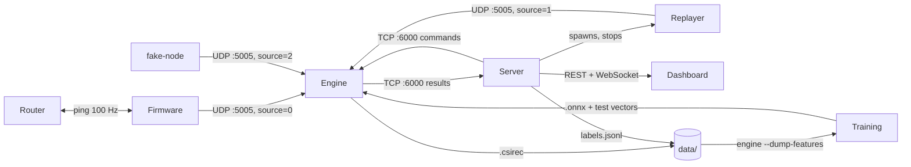

# WiFi Sensing — Code Plan

What has to be built, in order, so that at the end one ESP32-S3 and our router
produce presence, motion, breathing, person count, posture and fall alerts on a
dashboard with Home, School and Clinic profiles.

## 1. Components

| Component | Folder | Language | Does |
|---|---|---|---|
| Firmware | `firmware/` | C (ESP-IDF) | Pings the router at 100 Hz, captures CSI, sends frames over UDP |
| csirec library | `tools/csirec/` | C | Reads and writes `.csirec` files; used by every tool and the engine |
| fake-node | `tools/fake-node/` | C | Sends synthetic frames, so everything works without the ESP32 |
| recorder | `tools/recorder/` | C | UDP → `.csirec`, standalone capture |
| replayer | `tools/replayer/` | C | `.csirec` → UDP, stands in for the ESP32 |
| serial-bridge | `tools/serial-bridge/` | C | USB serial → UDP, fallback transport |
| Engine | `engine/` | C++ | Parses frames, DSP, ONNX inference, rules, records, sends results |
| Server | `server/` | Java 21, Spring Boot | Talks to the engine, REST + WebSocket, history, alerts, profiles, labelling |
| Scripts | `scripts/` | shell / Python | `run_all`, `fake-engine`, `check_session`, latency report |
| Models | `ml/` | Python | Trains M1 and M2, exports ONNX + test vectors |
| Dashboard | `ui/` | Next.js, TypeScript | Home / School / Clinic pages, labelling screen, alerts |

## 2. Data flow



- The engine is the only place where CSI is preprocessed. Training reads the
  engine's feature dumps.
- `.csirec` and `labels.jsonl` use the same clock: host wall-clock µs.
- All binary formats are little-endian.

## 3. Interfaces

These live in `contracts/` and are written before the code that uses them.

### 3.1 `contracts/csi_frame.h` (firmware → engine)

```c
#define CSI_MAGIC   0x31495343u   /* "CSI1" */
#define CSI_VERSION 1

#pragma pack(push, 1)
typedef struct {
  uint32_t magic;
  uint16_t version;            /* CSI_VERSION */
  uint16_t hdr_len;            /* sizeof(csi_frame_hdr_t) */
  uint8_t  node_id;
  uint8_t  source;             /* 0 live, 1 replay, 2 synthetic */
  uint8_t  sig_mode;           /* 0 non-HT, 1 HT */
  uint8_t  mcs;
  uint8_t  cwb;                /* 0 = 20 MHz, 1 = 40 MHz */
  uint8_t  stbc;
  uint8_t  first_word_invalid;
  uint8_t  gain_valid;         /* 1 if agc_gain / fft_gain are filled */
  uint8_t  agc_gain;
  int8_t   fft_gain;
  int8_t   rssi_dbm;
  int8_t   noise_floor_dbm;
  uint8_t  channel;
  uint8_t  secondary_channel;
  uint8_t  src_mac[6];         /* router MAC */
  uint32_t boot_id;            /* random per boot; ts_us and seq reset with it */
  uint64_t ts_us;              /* esp_timer, time since boot */
  uint32_t seq;
  uint16_t n_values;           /* int8 values that follow */
} csi_frame_hdr_t;
#pragma pack(pop)

#ifdef __cplusplus
static_assert(sizeof(csi_frame_hdr_t) == 46, "csi_frame_hdr_t size");
#else
_Static_assert(sizeof(csi_frame_hdr_t) == 46, "csi_frame_hdr_t size");
#endif

/* followed by int8_t data[n_values]: [imag, real] pairs per subcarrier,
   exactly as ESP-IDF wifi_csi_info_t.buf delivers them (no compensation). */
```

### 3.2 `contracts/recording.md` (engine / recorder → training)

```
.csirec file header:  char magic[4] = "CSIR"; uint16 version = 1; uint16 reserved = 0
each record:          uint32 len; uint64 host_rx_us; uint8 frame[len]
```

`labels.jsonl`, written by the server, host µs:

```json
{"kind":"segment","session":"s03","t_start_us":1767225600123456,"t_end_us":1767225660123456,"label":"sitting","count":1,"subject":"alex","layout":"L1"}
{"kind":"mark","session":"s03","t_press_us":1767225700456789,"event":"fall"}
```

### 3.3 `contracts/results.schema.json` (engine → server, every 0.5 s)

```json
{
  "type": "result", "v": 1,
  "ts": 1767225600123, "t_rx_last_us": 1767225600118000,
  "node": 1, "boot_id": 2913411, "source": "live",
  "rate_hz": 98.5, "loss": 0.012, "dropped_layout": 0,
  "calibration": {"state": "ok", "age_s": 312},
  "presence": true,
  "count":   {"value": 1, "p": [0.04, 0.91, 0.05], "src": "model"},
  "posture": {"label": "lying", "p": 0.87, "src": "model"},
  "motion": 0.03,
  "breathing": {"bpm": 14.2, "confidence": 0.81, "valid": true,
                "wave": [0.12, 0.18, 0.21, 0.17, 0.09]},
  "csi": [[0.4, 0.5, "... 52 values"], "... 5 rows"],
  "events": [{"id": 42, "type": "fall", "t": 1767225600100}]
}
```

- `posture` is `null` when nobody is present.
- `wave` and `csi` hold the last 0.5 s at 10 Hz.
- `events` are edge-triggered: `fall`, `fainted_suspected`, `no_breathing`.
  The server turns them into alerts.

### 3.4 `contracts/control.md` (server → engine)

The engine listens on TCP :6000. The server connects and reconnects every 1 s.
Results flow engine → server; commands flow server → engine on the same
connection. Every command has an `id`; the engine replies
`{"type":"ack","id":7,"ok":true,"error":null,"data":{}}`.

| Command | Arguments | Effect |
|---|---|---|
| `calibrate` | `duration_s`, `mode`: `empty` / `rolling` | Builds the per-subcarrier baseline |
| `set_source` | `mode`: `live` / `replay` / `synthetic` | The engine accepts only frames with that `source` |
| `record_start` | `session`, `path` | Starts writing `.csirec` (live only) |
| `record_stop` | — | Closes the file; returns the frame count and time range |
| `reload_models` | — | Reloads the `.onnx` files |
| `get_status` | — | Rate, loss, models, pipeline version, calibration |

### 3.5 `contracts/api.md` (server → dashboard)

| Method | Path | Purpose |
|---|---|---|
| GET | `/api/v1/status` | Latest result, engine status |
| GET | `/api/v1/history?node=&from=&to=` | Stored results for charts |
| GET | `/api/v1/alerts?state=open` | Open alerts |
| POST | `/api/v1/alerts/{id}/ack` | Acknowledge an alert |
| GET, PUT | `/api/v1/profile` | `home`, `school`, `clinic` |
| POST | `/api/v1/calibrate` | Starts calibration |
| GET, PUT | `/api/v1/source` | `{"mode":"replay","file":"s03.csirec","speed":1}` or `{"mode":"live"}` |
| POST | `/api/v1/recordings/start`, `/stop` | Labelled session |
| POST | `/api/v1/recordings/segment` | `{"label","count","subject","action":"start"|"end"}` |
| POST | `/api/v1/recordings/mark` | `{"event":"fall"}` |
| WS | `/ws/live` | `{"type":"result"}`, `{"type":"alert"}`, `{"type":"status"}` |

### 3.6 `contracts/model_io.md` (engine ↔ training)

Engine preprocessing (`PIPELINE_VERSION = 1`):

1. Keep HT frames (`sig_mode = 1`, `cwb = 0`, `stbc = 0`) with the expected `n_values`.
2. Take the HT-LTF part of `buf`; subcarriers k = −26 … −1, 1 … 26 (52 values).
3. Amplitude `sqrt(re² + im²)`; gain compensation from `agc_gain` / `fft_gain`.
4. Hampel filter per subcarrier (half-window 3, k = 3).
5. Resample to 50 Hz from `ts_us`, within one `boot_id`.
6. z-score per subcarrier against the calibration baseline.

`engine --dump-features in.csirec out` writes `out.features.npy` (float32
`[T, 52]`), `out.ts.npy` (uint64 `[T]`, host µs) and `out.meta.json`.

Models:

- Input `csi`, float32 `[1, 150, 52]` (3 s at 50 Hz), hop 25 samples, ONNX opset 17.
- M1 → `count_logits [1, 3]` = 0, 1, 2+.
- M2 → `posture_logits [1, N]` = standing, sitting, lying, walking. Run only when presence is true.
- `metadata_props`: `labels`, `pipeline_version`, `window`, `rate_hz`. The engine refuses a mismatched `pipeline_version`.
- Each model ships `*_input.bin` / `*_expected.bin` from onnxruntime-Python; C++ must match within 1e-4.

## 4. Build steps

Each step ends with a check that proves it works. Do the steps in order; within
a step, components can be built in parallel.

### Step 1 — End-to-end skeleton with fake data

- [ ] `contracts/`: write all six files from section 3
- [ ] `tools/csirec`: reader and writer + unit tests (round-trip)
- [ ] `tools/fake-node`: frames per `csi_frame.h`; flags `--rate`, `--breath-bpm`, `--loss`, `--reset-every`, `--mix-nonht`, `--motion-burst`
- [ ] `engine/`: CMake + GoogleTest; portable UDP socket (POSIX and Winsock); parser that validates `magic`, `version`, `hdr_len`, `n_values` and counts drops
- [ ] `engine/`: TCP :6000 server sending a stub result every 0.5 s (motion = amplitude variance); answers `get_status`
- [ ] `server/`: Spring Boot; engine client (connect, reconnect, JSON lines both ways); `/api/v1/status`, `/ws/live`; CORS for `localhost:3000`
- [ ] `scripts/fake-engine`: replays a results file and acks commands, for server and UI tests
- [ ] `ui/`: Next.js app; TypeScript types generated from `results.schema.json`; page with live motion from `/ws/live`
- [ ] `scripts/run_all`: starts fake-node, engine, server and UI with one command
- [ ] CI: build and test each folder; compile-check `static_assert` in C and C++; validate UI mock data against the schema

**Works when:** `run_all` shows live motion from fake-node in the browser.

### Step 2 — Real CSI from the ESP32

- [ ] `firmware/`: station on our router, `WIFI_PS_NONE`, ping the gateway at 100 Hz
- [ ] `firmware/`: CSI callback → FreeRTOS queue → UDP sender task; count queue drops
- [ ] `firmware/`: fill the header from `rx_ctrl` / `wifi_csi_info_t`, including gain values; random `boot_id` per boot; forward HT frames from the router MAC only (config flag to forward all)
- [ ] `firmware/`: auto-reconnect, watchdog
- [ ] `tools/recorder`: UDP → `.csirec` with `host_rx_us`
- [ ] Capture one real file; confirm the HT-LTF byte offsets and write them into `model_io.md`
- [ ] `engine/`: per-node ring buffer, `boot_id` handling, HT-LTF amplitude extraction, resample to 50 Hz, debug CSV dump

**Works when:** the real ESP32 delivers ≥ 80 Hz with < 5 % loss over 10 minutes, and the browser shows live motion from it.

### Step 3 — Signal processing

- [ ] `engine/`: gain compensation, Hampel filter, `PIPELINE_VERSION`
- [ ] `engine/`: `calibrate` command (`empty` and `rolling` modes); `calibration` field in results
- [ ] `engine/`: presence and motion 0–1
- [ ] `engine/`: breathing:
  - separate 30 s buffer at 50 Hz
  - pick the 8 subcarriers with the most power in 0.1–0.5 Hz, take their first principal component
  - band-pass 0.1–0.5 Hz (2nd-order Butterworth)
  - FFT with zero-padding + parabolic peak interpolation → bpm
  - `confidence` = peak power / band power; `valid` only if confidence ≥ c_min and motion stayed low for 20 s
  - reset the buffer after a motion spike
- [ ] `engine/`: `breathing.wave` and the `csi` heatmap rows in results
- [ ] `engine/`: `--dump-features`
- [ ] `server/`: `/api/v1/calibrate` → engine command
- [ ] `ui/`: Home page with state, breathing waveform chart, motion, timeline, CSI heatmap, calibrate button

**Works when:** breathing is within ±2 bpm of the known rate on 3 recordings, and the dashboard shows the waveform live.

### Step 4 — Recording and labelling pipeline

- [ ] `engine/`: `record_start` / `record_stop` via `tools/csirec`
- [ ] `server/`: H2 (file mode) history; `/api/v1/history`
- [ ] `server/`: recordings API: session id, engine record commands, `labels.jsonl` writer in host µs
- [ ] `ui/`: labelling screen with start/stop, segment buttons, "fall now" mark and keyboard shortcuts
- [ ] `ui/label-cli`: fallback labeller that writes `labels.jsonl` directly
- [ ] `scripts/check_session`: checks that every label falls inside the `.csirec` time range
- [ ] `tools/replayer`: timing from `host_rx_us`, `--speed`, `--loop`, forces `source = 1`
- [ ] `engine/`: `set_source` command; frames filtered by `source`
- [ ] `server/`: `/api/v1/source` spawns and stops the replayer
- [ ] `contracts/fixtures/`: one small real `.csirec` + labels + expected features; CI compares the engine's `--dump-features` output with it

**Works when:** a session labelled from the UI produces a `.csirec` + `labels.jsonl` that pass `check_session`, and replaying that file gives the same results as the live run.

### Step 5 — Models

- [ ] `ml/`: loader: engine feature dumps + `labels.jsonl` → labelled 3 s windows, joined on host time, configurable press offset for marks
- [ ] `ml/`: split config with locked test sessions; the training script refuses to train on them
- [ ] `ml/`: M1 and M2 training, augmentation (noise, time shift, amplitude scale)
- [ ] `ml/`: ONNX export with `metadata_props` + test vectors; PyTorch vs ONNX Runtime check at 1e-3
- [ ] `ml/`: evaluation: per-class accuracy, confusion matrix, fall recall per event, false alarms per hour
- [ ] `ml/`: coarse M2 fallback (`still`, `moving`) in case 4 postures are not accurate enough
- [ ] `engine/`: ONNX Runtime (pinned prebuilt release); load M1 and M2; read labels from metadata; refuse a mismatched `pipeline_version`; `reload_models`
- [ ] `engine/`: presence from M1 (motion threshold if M1 is missing); M2 only when present; `src` field
- [ ] CI: every `.onnx` + test vector runs through the C++ engine

**Works when:** test vectors pass in CI, and live results show model count and posture with accuracy measured on the locked test sessions.

### Step 6 — Rules, alerts, profiles

- [ ] `engine/`: rules, thresholds in `engine/config/rules.yaml`:

  | Event | Condition |
  |---|---|
  | `fall` | motion peak > T_fall, then motion < T_still for ≥ 3 s; if M2 is confident, posture = `lying` |
  | `fainted_suspected` | `fall` or `lying`, then motion < T_still for 10 s |
  | `no_breathing` | presence, posture `lying` / `sitting`, breathing `valid` within the last 60 s, confidence < c_low for 20 s, motion < T_still |

- [ ] `engine/`: edge-triggered events with ids; rule fallback when a model is missing or unsure
- [ ] `engine/`: `--evaluate recording.csirec labels.jsonl` → fall recall per event and false alarms per hour, for tuning `rules.yaml`
- [ ] `server/`: alerts from events with per-profile settings in `profiles.yml`; `/api/v1/alerts`, acknowledge; `/api/v1/profile`
- [ ] `ui/`: School and Clinic pages, profile switcher, alert banner with acknowledge, phone layout

**Works when:** a fall in front of the sensor raises an alert on the dashboard and on a phone, and 10 s of stillness after it raises `fainted_suspected`.

### Step 7 — Hardening

- [ ] `firmware/`: channel, ping rate and node id configurable over serial, stored in NVS
- [ ] `firmware/` + `tools/serial-bridge`: USB serial transport with the same framing
- [ ] `ui/`: replay banner when `source` ≠ `live`; calibration status; connection-lost state
- [ ] `server/`: latency stamps per stage (`t_rx_last_us` → ingest → WebSocket push); `scripts/latency_report` with p50 / p95
- [ ] `engine/`: < 100 ms processing per window
- [ ] `server/`: serve the UI static export; `run_all` for live or replay mode
- [ ] Retrain M1 and M2 on all non-test sessions; final evaluation

**Works when:** everything in section 5 passes.

## 5. Working system checklist

- [ ] `run_all` starts the whole system with one command, live or replay
- [ ] ESP32 streams ≥ 80 Hz, < 5 % loss; recovers by itself after a reboot or Wi-Fi drop
- [ ] Calibrate from the dashboard; presence and motion respond within 1 s
- [ ] Breathing within ±2 bpm when the person is still; waveform visible
- [ ] Count 0 / 1 / 2+ and posture from the models, accuracy measured on held-out sessions
- [ ] Fall → alert; stillness after it → `fainted_suspected`; acknowledge works
- [ ] Home, School and Clinic profiles switch alerts and pages
- [ ] Switch to replay from the dashboard and back, with the banner shown
- [ ] Frame receipt → screen under 1 s (p95)
- [ ] CI green on all jobs
