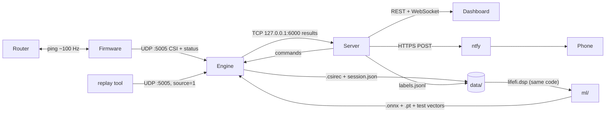

# Life-Fi Plan v2

This is the single plan for Life-Fi. It replaces
[implementation-plan.md](../archive/implementation-plan.md),
[plan-audit-and-model-research.md](../archive/plan-audit-and-model-research.md) and
[build-guide.md](../archive/build-guide.md) as the document to build from. The older
files stay as background reading. Where they disagree with this file, this
file wins.

The companion document [csi-for-models.md](csi-for-models.md) lists
everything the models and detectors need from the CSI: fields, configuration,
byte layout, preprocessing, derived signals, quality gates and recordings,
model by model.

**Goal (unchanged).** One ESP32-S3 and our own router produce presence,
motion, breathing, fall alerts and posture on a dashboard with Home, School
and Clinic profiles. Alerts also reach a phone.

**Reliability tags** (same as the build guide):

| Tag | Meaning |
|---|---|
| **[V]** | Checked against source code, documentation or a paper in the earlier docs |
| **[I]** | Inferred or from memory. Confirm before relying on it; most are on the Phase 2 checklist |
| **[H]** | Engineering heuristic. A starting value to tune on our recordings |

## Contents

1. Audit of the three earlier documents
2. Decisions this plan makes, and why
3. System overview
4. Contracts v2
5. Signal pipeline
6. Detectors and models
7. Server, alerts and phone notifications
8. Dashboard
9. Build phases
10. Recordings
11. Profiles
12. Acceptance checklist
13. What to expect from each output
14. Risks and open questions
15. Hardware and setup list

---

## 1. Audit of the three earlier documents

The earlier audit reviewed the implementation plan. The build guide then
added implementation detail. Nobody reviewed the three documents together,
and nobody reviewed the audit or the guide. This section does both.

There are three kinds of finding:

- **C**: the documents contradict each other, so a builder would not know
  which one to follow.
- **N**: a new weakness. It is in the build guide or the audit, or all three
  documents miss it.
- **A**: findings from the earlier audit (A.1 #1–21). Each one is listed
  with the place this plan fixes it.

Severity: **Blocker** means the system will not work as described. **Major**
means it works but gives wrong results in an important scenario. **Minor**
means worth fixing, but it won't sink the demo.

### 1.1 Contradictions between the documents

| # | Severity | Contradiction | Resolution in this plan | Why |
|---|---|---|---|---|
| C1 | Major | Engine language. The plan says C++. The audit recommends Python. The guide says "Python if skills allow", but then writes everything for C++ (ORT C++ API, an ONNX graph-merge trick, C++ parity fixtures). | **Python engine** (§2, D1) | The decision changes half the work. Leaving it open means two half-built designs. |
| C2 | Minor | Which LTF to use. The plan says HT-LTF only. The audit says LLTF as a fallback. The guide says "whatever `model_io.md` says". | **LLTF for everything** (D2) | One choice has to be written into the contract. |
| C3 | Major | `fainted_suspected`. The plan says "`lying` + 10 s still". The audit says "fall, or an uncalm lie-down, + 20–30 s". The guide says "fall + 20–30 s". The plan's Step 6 check still says 10 s. | **Fall, then 20 s still** (§6.5) | The plan's rule fires on everyone resting in bed. The "uncalm lie-down" variant is undefined and hard to test. |
| C4 | Major | Source of presence. The plan says "from M1, else the motion threshold". The audit and guide use a presence state machine. M1 class 0 (empty) and the state machine can disagree. | **Presence comes only from the state machine.** The count model, if built, only separates 1 from 2+ while present (§6.1, §6.9) | Two sources for the same fact contradict each other at the worst moments. |
| C5 | Major | `rolling` calibration. The plan offers it as a normal mode. The audit says freeze it while someone is present. The guide adds drift re-baselining but keeps `rolling` in the control contract. | `rolling` removed. **Empty calibration + automatic re-baseline during confirmed-empty periods** (§6.6) | A rolling median absorbs a still person (A3). Because models no longer depend on calibration (D3), a bad calibration now only affects still-person presence. |
| C6 | Minor | Model size. The plan says "under 1 M parameters". The audit says < 100 k. The guide's CNN has 43 k. | **About 43 k** (§6.8) | Our data (hundreds to a few thousand windows) cannot support 1 M parameters. |
| C7 | Minor | Test-vector tolerance: 1e-4 (C++ vs Python) in one place and 1e-3 (PyTorch vs ORT) in another. | One check: **PyTorch vs ORT ≤ 1e-4 absolute on logits** (§6.8) | With a Python engine, ORT in the engine is the same ORT as in the test. Only the export step needs checking. |
| C8 | Major | Recording plan. Plan §5 asks for 6–8 min of each static posture. Audit B.6 asks for transition repetitions. They were never merged, and neither estimates total time. | **One recording plan** with a time budget (§10) | Recording is the bottleneck. It needs one list and one number. |
| C9 | Minor | Build order. The plan puts models before rules. The guide puts rules first. | **Rules and alerts before models** (§9) | Rules deliver the main demo value with no training data. |
| C10 | Minor | Event list. The plan has 3 events. The audit adds 4, one of them optional. The guide adds `sensor_offline` and a lifecycle. | **One event table** (§4.5) | The schema must be fixed before Phase 1. |
| C11 | Major | Synthetic data. The plan pre-trains M1/M2 on `synth.py`. The audit says use it for tests only. The plan was never updated. | **Synthetic data for tests only** (§6.12) | Hand-made windows teach the model the generator's assumptions (A8). |
| C12 | Minor | The School after-hours alert uses count, but the audit ranks the count model "Could" and weak. | **After-hours alert uses presence** (§11) | A must-have alert must not depend on an optional, weak model. |
| C13 | Minor | ONNX opset. The plan fixes opset 17. The guide notes that PyTorch's default exporter targets ≥ 18. | **Opset 18, current exporter** (§6.8) [I] | Don't build on an exporter path that is being deprecated. Recent ORT versions run opset 18. |
| C14 | Blocker | Gain compensation. The plan has the engine compute it from `agc_gain`/`fft_gain`. The guide says the formula is closed-source, so the firmware must send the factor. | **The firmware sends `gain_comp`** (§4.1) | The engine cannot reproduce a closed formula [V per guide]. |

### 1.2 New weaknesses

| # | Severity | Weakness | Where | Fix (section) |
|---|---|---|---|---|
| N1 | Major | `esp_csi_gain_ctrl` builds its gain baseline from the first ~100 packets **after each boot** [I]. The compensated amplitude scale can therefore change at every reboot. Empty-room baselines and model inputs taken before the reboot no longer match. | guide §1.3 | Work in **log amplitude (dB)**, where a global gain is an additive offset, and make every feature remove that offset: per-window mean removal, correlation and band-pass. (§5, D3) |
| N2 | Major | Compensation is only valid after the 100-packet gain baseline. The guide's callback sends those early frames without saying so. | guide §1.3 | `gain_valid = 0` until the baseline exists. The engine drops those frames, plus a 3 s warm-up after every new `boot_id`. (§4.1, §5.4) |
| N3 | Major | The guide's breathing step decimates with `resample_poly`, which is block-based and non-causal. This breaks its own rule that every filter is causal and stateful. Live and dumped features would differ. | guide §3.3 | Stateful SOS low-pass, then keep every 5th sample. Add a CI test that chunked and whole-file processing give identical output. (§5.3, §5.5) |
| N4 | Major | Breathing PC1 sign fix: "flip if `dot(v_now, v_prev) < 0`" compares vectors over **different** subcarrier sets whenever the top-8 selection changes, so the dot product means nothing. | guide §3.3 | Embed `v` in 52 dimensions (zeros for unselected subcarriers). Re-select at most every 10 s, and only if the new set scores 20 % better. (§6.3) |
| N5 | Major | The cessation detector does not fix latency as claimed. The 10 s RMS takes ~9 s to fall below 0.3·ref, then must stay there for 10–15 s, then Home adds `delay_s` 10. That is ~30–35 s, not far from the 35–45 s it was meant to fix. Also, during apnea the top-8 subcarrier selection runs on noise. | audit #6, guide §3.4 | **Time since the last detected breath** on a projection vector **frozen** at the last valid breathing. Fire at 12 s [H], with `delay_s` ≤ 5. Expected latency ~13–18 s. (§6.4) |
| N6 | Major | Deadlock between presence and the drift detector. Drift (moved furniture, an open door) raises `S`, which holds PRESENT forever ("never drop to EMPTY on stillness alone"). The drift detector only runs while EMPTY, so it never re-baselines. | guide §3.2, §3.9 | New `presence_uncertain` state. Present, no motion for 10 min, and no valid breathing ever seen since entry → mark uncertain and ask for recalibration. If breathing *was* seen, `no_breathing` has already fired. (§6.1) |
| N7 | Minor | "Exit-like motion burst" is used but never defined. | guide §3.2 | Defined in §6.1. |
| N8 | Major | Events are sent only on edges. If the server is disconnected at the moment of an edge (reconnect, restart), it never learns the event started or ended. | audit #10, guide §0 | Every result also carries `active`, the ids of all currently active events, so the server can reconcile. (§4.5) |
| N9 | Major | Model input is z-scored against the empty-room baseline. That keeps the static, position-dependent part of the signal (the reason posture fails across rooms, A7). It also makes every model depend on the calibration mode (A5). | plan §3.6, guide §2 | Model input = **window minus its own per-subcarrier mean, in dB**. It is gain-free, carries no position offset and needs no calibration. That fixes A5 by construction. (§5.6) |
| N10 | Minor | Gap handling is undefined. The guide says "mark gaps over 50 ms invalid, never bridge", but IIR filters and model windows still need a rule. | guide §2 | Explicit gap policy (§5.4). |
| N11 | Minor | The z-score has no floor on σ. A quiet subcarrier in the empty room makes z explode. | plan, guide | `σ ≥ σ_floor` (§5.6). |
| N12 | Major | `manu_scale = 1` with a fixed `shift` is recommended, but no value is chosen. Too high clips int8. Too low throws away resolution. | audit #12, guide §1.2 | Measure on the real device in Phase 2 ([csi-for-models §2.2](csi-for-models.md)). |
| N13 | Major | Untested assumption: the router answers 100 pings/s. Many routers rate-limit ICMP. | all | Phase 2 check, and `ping_timeouts` in the status packet (§4.2). |
| N14 | Minor | Routers often transmit at different power per MCS or frame type. Mixing them gives amplitude steps that look like motion. | audit #13 | Phase 2 check. If steps show up, keep only the dominant frame type and MCS. ([csi-for-models §8](csi-for-models.md)) |
| N15 | Major | A fixed 0.4 s reaction offset for marks. Human reaction varies by several hundred ms, and transition labels with ±0.5 s jitter blur a 2–4 s event. | plan §3.2 | **Snap each mark to the motion-energy peak within ±1.5 s.** Optionally film the session for checks. (§10.3) |
| N16 | Blocker | The models depend on recordings that "the plan doesn't schedule". No phase owns them. | plan §5 | Recording sessions are scheduled phases. Unlabelled long runs start as soon as the ESP32 streams. (§9, §10) |
| N17 | Minor | Metrics are reported without uncertainty. 18 of 20 falls is "90 %", but the 95 % Wilson interval is ~70–97 %. | plan, audit #19 | Report every rate with a confidence interval (§12). |
| N18 | Minor | The guide's `onsite_adapt` steps (2 + 5–10 + ~6 + 2 min) exceed the 15-minute target. | guide §4.6 | Reuse the guided recording as the unlabelled AdaBN data. The budget becomes ~12 min (§6.11). |
| N19 | Minor | Alerts go through the public ntfy.sh relay, and the topic name is the only secret. | guide §7 | Minimal payload with no health detail, or self-host ntfy on the laptop (§7.3). |
| N20 | Minor | Cole–Kripke coefficients were fitted to wrist-actigraphy counts. Applying them to Wi-Fi motion counts is unvalidated. | guide §3.7 | Show it as "restlessness / rest periods", not "sleep". Priority "Could". (§6.10) |
| N21 | Major | Safety and consent for recording falls and breath-holds with students, who may be minors. | all | Consent (and guardian consent for minors), a thick mat, a taught fall technique, breath-holds only by volunteers and never longer than 30 s (§10.4). |
| N22 | Major | Breathing, `no_breathing` and the fall rules silently assume **one person** in the zone. No document says so. | all | Stated as a profile assumption. The UI shows it. Breathing turns invalid when a count model or a motion pattern suggests 2+ people. (§11, §13) |
| N23 | Minor | Sessions have no metadata (placement, firmware, CSI config, who was in the room). | plan §3.2 | A `session.json` sidecar for every `.csirec` (§4.3). |
| N24 | Minor | Automatic fallback to replay during the pitch could look like live data. | guide §10 #9 | A replay banner that cannot be dismissed. Never present replay as live (§8). |
| N25 | Minor | The breathing band (6–30 /min) excludes children at rest, so the School profile breathing would be wrong. | guide §3.3 | Breathing is neither shown nor stored in School (§11). |
| N26 | Minor | The streaming Hampel filter needs 3 samples carried across chunk boundaries, and adds a 3-sample delay. Neither is specified. | plan §3.6 | Specified in §5.3. |

### 1.3 Earlier audit findings: where they are fixed

| A# | Finding (short) | Fixed in |
|---|---|---|
| 1 | Gain values aren't in `rx_ctrl` | §4.1 (`esp_csi_gain_ctrl`, `gain_comp` field); D3 adds robustness |
| 2 | Presence misses still people | §6.1 presence state machine |
| 3 | `rolling` absorbs a still person | C5: `rolling` removed; §6.6 re-baseline only when empty |
| 4 | `fainted_suspected` fires on anyone resting | §6.5: needs a fall, then 20 s still |
| 5 | Train/serve calibration skew | §5.6: model input needs no calibration (N9) |
| 6 | `no_breathing` latency | §6.4 (and N5) |
| 7 | Static posture is the wrong target | §6.8 transition model + §6.7 posture state machine |
| 8 | Synthetic pre-training | §6.12: tests only |
| 9 | `onsite_adapt` random hold-out leakage | §6.11: a separate validation pass |
| 10 | Events have no "cleared" state | §4.5: `state` + `active` snapshot (N8) |
| 11 | Scope | D1 (Python engine), D7 (Must/Should/Could), §9 |
| 12 | CSI config unspecified | §4.6; [csi-for-models §2](csi-for-models.md) |
| 13 | HT-only filtering drops frames | D2: LLTF from every frame |
| 14 | `first_word_invalid` | §5.2 |
| 15 | No anti-alias filter | §5.3 |
| 16 | ESP32 → host clock mapping | §5.3 |
| 17 | Outputs flicker, no calibration | §6.8 (temperature, `uncertain`), §6.7 (peak-picking), §6.9 (count smoothing) |
| 18 | Breathing ground truth | §10.2: chest reference |
| 19 | FA/h statistics | §12: confidence intervals, long unlabelled runs |
| 20 | Privacy and regulation | §7.4, §11, §13 |
| 21 | Unauthenticated ports | §7.4 |

### 1.4 What the earlier documents got right (kept)

- Contracts first, and a replayer that sends exactly the device's packets.
  Every part can be built and demoed without hardware.
- Splits by whole session, locked test sessions, leave-one-room-out, and FA/h
  plus per-event recall as the metrics.
- Rules for rare events. Profiles decide alerts on the server, so a threshold
  lives in one place.
- Small models, so they can be adapted on site.
- An honest table of expectations.

---

## 2. Decisions this plan makes, and why

These decisions are fixed for v2. Changing one means updating the contracts.

| # | Decision | Why |
|---|---|---|
| D0 | **Before anything else, confirm the EduHack.bg rules** on code written before the event. | If code must be written on site, scope shrinks to the Must tier (D7) and the pre-built parts become "research and design" only. Every other decision depends on this. |
| D1 | **The engine and all tools are Python** (numpy, scipy, onnxruntime). The firmware stays C, the server Java/Spring, the UI Next.js. | 50 Hz × 52 values is a trivial load for numpy. Training imports *the same* preprocessing module as the engine, so train/serve skew cannot happen by construction. The C++ engine, its CMake/Winsock/ORT setup, the C++-vs-Python test vectors and the C `csirec` library all disappear. That is 4 languages instead of 5, and roughly 3 components fewer. **If the team must keep C++,** keep the contracts unchanged and add back the parity fixtures from the old plan Step 4. |
| D2 | **Use LLTF for every frame** (subcarriers k = ±1…±26). Also send HT-LTF so we can compare. | LLTF is present in both HT and non-HT frames, so no frames are dropped for layout. It has exactly the 52 indices the plan already uses. In an HT frame, LLTF is sent before any HT spatial mapping, so it should be less affected by the router's beamforming or antenna mapping [I]. **This is confirmed or reversed by a Phase 2 measurement** ([csi-for-models §8](csi-for-models.md)). |
| D3 | **Work in log amplitude (dB).** Firmware compensates the gain. Every feature removes a constant offset. | A gain change is a multiplication. In dB it becomes an added constant, which per-window mean removal, correlation and band-pass all cancel. Compensation handles gain steps *inside* a session; the dB domain handles scale changes *between* boots (N1) and leftover compensation error. |
| D4 | **The learned posture model predicts transitions** (`sit_down`, `stand_up`, `lie_down`, `get_up`, `walking`, `none`). Current posture comes from a state machine. | A static posture model learns *where* the person is, not how they hold their body, and does not carry over to a new room (A7). Transitions have distinctive 2–4 s motion signatures. |
| D5 | **Presence is a state machine** over static deviation, breathing energy and motion. | A variance threshold is a motion detector. It reports a still person as gone, which blinds the Home and Clinic scenarios (A2). |
| D6 | **Rules and alerts come before models** in the build order. | Falls, fainting and breathing stopping are detected by rules. They deliver the core demo with zero training data. |
| D7 | **Scope tiers.** Must: firmware, record/replay, engine with presence, motion, breathing, cessation and fall → fainted; server alerts, ntfy, sensor-offline; Home and Clinic pages; placement guide. Should: labelling + transition model, School page, bed exit, fixed-rule long inactivity, `onsite_adapt`, drift re-baseline. Could: count 1/2+, occupancy level, restlessness, learned routine, serial bridge, OTA, MQTT/Home Assistant. | A hackathon project fails by being unfinished, not by missing features. Each tier is a working demo on its own. |
| D8 | **Phone alerts through ntfy.** | A single HTTP POST, apps for Android and iOS, no account, can be self-hosted [V per guide]. Web Push needs HTTPS and, on iOS, an installed PWA. SMS costs money. |
| D9 | **H2 file database** in the server. **Downsampled history** (1 row / 5 s), with no raw CSI. | No database server to install. Health data is kept to a minimum. |

---

## 3. System overview

### 3.1 Components

| Component | Folder | Language | Does | Tier |
|---|---|---|---|---|
| Firmware | `firmware/` | C (ESP-IDF 5.4/5.5) | Pings the router, captures CSI, sends frames and a 1 Hz status packet over UDP | Must |
| Contracts | `contracts/` | C header, JSON Schema, Markdown | The interfaces of §4 | Must |
| Engine | `engine/` | Python 3.12 | UDP in, DSP, detectors, ONNX inference, rules, recording, TCP results | Must |
| Tools | `engine/tools/` | Python | `record`, `replay`, `fakesensor`, `check_session`, `dump_features`, `evaluate`, `serial_bridge` (Could) | Must (except the bridge) |
| Server | `server/` | Java 21, Spring Boot | Engine client, REST + WebSocket, history, alerts, profiles, labelling, ntfy, watchdog | Must |
| Models | `ml/` | Python | Loaders, GBM and CNN training, export, evaluation, `onsite_adapt` | Should |
| Dashboard | `ui/` | Next.js, TypeScript | Home / School / Clinic pages, labelling, alerts, health, settings | Must |
| Scripts | `scripts/` | shell | `run_all`, `latency_report` | Must |

`engine/` is one Python package (`lifefi`). `lifefi.dsp` is imported by both
the engine and `ml/`. That shared import replaces design rule 1's fixtures.

### 3.2 Data flow



### 3.3 Design rules

Each rule prevents a specific class of bug.

1. **One preprocessing implementation** (`lifefi.dsp`), used live, by
   `dump_features` and by training. *Prevents train/serve skew.*
2. **All filters are causal and keep state across chunks.** CI checks that
   feeding a file in random chunk sizes gives byte-identical features to
   feeding it whole. *Prevents live features differing from dumped ones (N3).*
3. **Labels and recordings use one clock: host wall-clock µs.** *The ESP32
   clock restarts at every boot.*
4. **The replay tool sends byte-identical packets**, except `source = 1`.
   *Everything can be developed and demoed from recordings.*
5. **The engine reports conditions. The server decides alerts.** *A threshold
   is never tuned in two places.*
6. **Every threshold lives in `engine/config/rules.yaml` or `profiles.yml`,**
   and its hash travels with every result. *Evaluations stay reproducible.*
7. **All binary formats are little-endian.**

---

## 4. Contracts v2

These files live in `contracts/`. They are written and agreed in Phase 0,
before any code that uses them.

### 4.1 `csi_frame.h` (firmware → engine), version 2

```c
#define CSI_MAGIC   0x31495343u   /* "CSI1" */
#define CSI_VERSION 2

#pragma pack(push, 1)
typedef struct {
  uint32_t magic;
  uint16_t version;            /* CSI_VERSION */
  uint16_t hdr_len;            /* sizeof(csi_frame_hdr_t) */
  uint8_t  node_id;
  uint8_t  source;             /* 0 live, 1 replay */
  uint8_t  sig_mode;           /* 0 non-HT, 1 HT */
  uint8_t  mcs;
  uint8_t  cwb;                /* 0 = 20 MHz */
  uint8_t  stbc;
  uint8_t  first_word_invalid;
  uint8_t  gain_valid;         /* 1 once the gain baseline exists (N2) */
  uint8_t  agc_gain;           /* raw, from esp_csi_gain_ctrl_get_rx_gain */
  int8_t   fft_gain;
  int8_t   rssi_dbm;
  int8_t   noise_floor_dbm;
  uint8_t  channel;
  uint8_t  secondary_channel;
  uint8_t  src_mac[6];         /* router MAC */
  uint8_t  csi_parts;          /* bit0 LLTF, bit1 HT-LTF, bit2 STBC-HT-LTF2 present in data */
  uint8_t  csi_shift;          /* manual scale shift in use */
  uint16_t rx_seq;             /* 802.11 sequence number of the received frame */
  float    gain_comp;          /* linear amplitude factor from esp_csi_gain_ctrl [I: verify unit] */
  uint32_t boot_id;            /* random per boot */
  uint64_t ts_us;              /* esp_timer_get_time(), 64-bit */
  uint32_t seq;                /* UDP packet counter, per boot */
  uint16_t n_values;           /* int8 values that follow */
} csi_frame_hdr_t;
#pragma pack(pop)
/* static_assert(sizeof(csi_frame_hdr_t) == 54) in C and C++ */
/* followed by int8 data[n_values]: wifi_csi_info_t.buf, unmodified */
```

What changed from v1, and why:

- **`gain_comp`** (C14): the compensation formula is closed-source, so the
  firmware must send the factor. Raw `agc_gain`/`fft_gain` are kept so we
  can analyse them later.
- **`gain_valid`** (N2): the factor is meaningless before the gain baseline
  exists.
- **`csi_parts`, `csi_shift`**: the engine can find LLTF and HT-LTF in
  `data` without guessing from `n_values`, and a recording records its own
  scale setting.
- **`rx_seq`**: tells router-side losses (gaps in the 802.11 sequence
  number) apart from UDP losses (gaps in `seq`). That separates "the router
  doesn't answer fast enough" from "the network to the laptop drops packets".

Data stays raw. Re-processing old recordings with a better pipeline is
always possible.

### 4.2 Status packet (firmware → engine, 1 Hz)

The status packet goes to the same port, with a different magic. It is what
makes `sensor_offline` and the device-health tile possible.

```c
#define STATUS_MAGIC 0x31415453u  /* "STA1" */
typedef struct {
  uint32_t magic; uint16_t version; uint16_t hdr_len;
  uint8_t  node_id; uint8_t reset_reason; uint8_t channel; int8_t rssi_dbm;
  uint32_t boot_id; uint64_t uptime_us;
  uint32_t free_heap; uint32_t min_free_heap;
  uint32_t csi_cb_count; uint32_t queue_drops; uint32_t send_errors;
  uint32_t wifi_disconnects;
  uint16_t ping_rate_hz; uint16_t ping_timeouts_last_s;   /* N13 */
  char     fw_version[16];
} status_pkt_t;   /* packed, 68 bytes */
```

### 4.3 Recordings: `.csirec`, `session.json`, `labels.jsonl`

```
.csirec header:  char magic[4]="CSIR"; uint16 version=1; uint16 reserved=0
each record:     uint32 len; uint64 host_rx_us; uint8 packet[len]   (CSI or status packet)
```

Status packets are stored too. A recording then explains its own gaps.

`session.json` (N23), written by the server at `record_start`:

```json
{"session":"s03","room":"R2","layout":"L1","started_us":1767225600000000,
 "firmware":"0.4.1","csi_config":{"lltf":1,"htltf":1,"merge":0,"filter":0,"shift":4},
 "router":{"model":"…","channel":6,"txbf":"off"},
 "placement":{"distance_m":4.0,"height_m":1.1,"photo":"s03_setup.jpg"},
 "subjects":["P01","P03"],"consent_ids":["C01","C03"],"notes":""}
```

`labels.jsonl`, in host µs, non-overlapping segments:

```json
{"kind":"segment","session":"s03","t_start_us":…,"t_end_us":…,"label":"sitting","count":1,"subject":"P01","spot":"A"}
{"kind":"mark","session":"s03","t_press_us":…,"event":"sit_down","subject":"P01"}
{"kind":"mark","session":"s03","t_press_us":…,"event":"fall","subject":"P01"}
```

- Segment labels: `empty`, `standing`, `sitting`, `lying`, `walking`,
  `normal_activity`, `in_bed`, `bed_empty`, `paced_breathing_<bpm>`,
  `breath_hold`.
- Mark events: `sit_down`, `stand_up`, `lie_down`, `get_up`, `fall`,
  `bed_exit`, `breath_hold_start`, `breath_hold_end`, `hard_negative_<what>`.
- `subject` is a pseudonym (P01 …). The list linking pseudonyms to names
  stays on paper.

### 4.4 Control (server → engine, TCP 127.0.0.1:6000, JSON lines)

The engine listens; the server connects and reconnects every 1 s. Every
command has an `id`, and the engine answers
`{"type":"ack","id":7,"ok":true,"error":null,"data":{}}`.

| Command | Arguments | Effect |
|---|---|---|
| `calibrate` | `kind`: `empty` / `bed_empty` / `bed_occupied`, `duration_s` | Builds that profile (§6.1, §6.6, §6.9). Refuses `empty` if motion is seen during it |
| `set_source` | `mode`: `live` / `replay` | The engine accepts only frames with that `source` |
| `record_start` | `session`, `path`, `meta` | Writes `.csirec` + `session.json` (live only) |
| `record_stop` | — | Returns the frame count and time range |
| `reload_models` / `reload_rules` | — | Reloads the files; the new `config_hash` appears in results |
| `get_status` | — | Rate, loss, rejects by reason, inference p50/p95, models, calibration, `config_hash` |

`rolling` is gone (C5).

### 4.5 `results.schema.json` (engine → server, every 0.5 s), version 2

```json
{
  "type": "result", "v": 2,
  "ts": 1767225600123, "t_rx_last_us": 1767225600118000,
  "node": 1, "boot_id": 2913411, "source": "live",
  "config_hash": "9f3a1c", "pipeline_version": 2,
  "health": {"rate_hz": 88.1, "loss_udp": 0.004, "loss_air": 0.03,
             "invalid_ratio": 0.0, "rejected": {"layout": 0, "gain_invalid": 0},
             "warmup": false},
  "calibration": {"state": "ok", "id": "cal-0007", "age_s": 312},
  "presence": {"value": true, "state": "present", "S": 0.21, "B": 0.80, "M": 0.03},
  "motion": 0.03,
  "posture": {"label": "lying", "since": 1767225590000, "src": "transitions"},
  "count": {"value": 1, "p": [0.9, 0.1], "src": "model"},
  "breathing": {"bpm": 14.2, "confidence": 0.81, "valid": true,
                "wave": [0.12, 0.18, 0.21, 0.17, 0.09]},
  "csi": [["… 52 values"], "… 5 rows"],
  "events": [{"id": 42, "type": "fall", "state": "active", "t": 1767225600100, "data": {"peak": 0.93}}],
  "active": [42]
}
```

- `presence.state`: `empty`, `present` or `uncertain` (N6).
- `posture`: `null` when not present. `label` is `unknown` until the first
  transition or walking has been seen.
- `count.value`: 1 or 2 (2 means 2+). The field exists only when the count
  model is loaded. Otherwise it is `null`.
- `events` lists **only changes** in this window. `active` lists **every**
  currently active event id. A server that reconnects compares `active` with
  its open alerts (N8).
- `health.warmup` is true for 3 s after a new `boot_id`, and until each
  detector has the history it needs. No event can start during warm-up.

**Events.** The engine emits the first group. The server emits the last two.

| Type | Cleared when | Tier |
|---|---|---|
| `fall` | sustained motion followed by `get_up` or walking | Must |
| `fainted_suspected` | as `fall` | Must |
| `no_breathing` | two consecutive breaths, or motion | Must |
| `presence_uncertain` | new calibration, or clear motion/breathing | Should |
| `recalibrate_needed` | new calibration | Should |
| `bed_exit` | back in bed | Should |
| `sensor_offline` (server) | results healthy for 10 s | Must |
| `long_inactivity` (server) | motion | Should |

### 4.6 `model_io.md` (engine ↔ training)

- `PIPELINE_VERSION = 2`: the preprocessing chain of §5, with every
  parameter listed, plus the firmware CSI configuration
  ([csi-for-models §2](csi-for-models.md)). Any change bumps the version.
- `dump_features in.csirec out/` writes `F.npy` (float32 `[T, 52]`, dB,
  50 Hz), `valid.npy` (bool `[T]`), `ts.npy` (uint64 host µs) and
  `meta.json` (pipeline version, CSI config, chunk-invariance hash).
  `dump_features` does **not** z-score. Calibration-dependent views are
  computed from `F` when needed.
- Model input `x`: float32 `[1, 150, 52]` (3 s at 50 Hz). Each subcarrier
  has its window mean subtracted, the result is divided by 1 dB and clipped
  to ±10 (§5.6). The transpose to channels-first happens inside the model.
- Two input kinds, declared in metadata:
  - `input_kind = "window"` (CNN): input `x`.
  - `input_kind = "features"` (GBM): input `f [1, F]`, computed by
    `lifefi.features`, with the version in `feature_set_version`.
- Outputs: `probs [1, N]`. Softmax and temperature are inside the graph,
  so every model returns probabilities.
- `metadata_props`: `labels` (JSON), `pipeline_version`, `input_kind`,
  `feature_set_version`, `window`, `rate_hz`, `temperature`,
  `uncertain_below`, `trained_on` (session ids), `git_sha`.
- The engine **refuses** a model whose `pipeline_version` or
  `feature_set_version` does not match.
- ONNX opset 18. A `.pt` checkpoint is shipped next to every `.onnx`,
  because AdaBN and fine-tuning need the BatchNorm layers that export folds
  into Conv [V per guide].

### 4.7 `api.md` (server → dashboard)

| Method | Path | Purpose |
|---|---|---|
| GET | `/api/v1/status` | Latest result, engine and device health |
| GET | `/api/v1/history?from=&to=&fields=` | Downsampled history |
| GET | `/api/v1/alerts?state=` | `pending`, `open`, `acked`, `resolved` |
| POST | `/api/v1/alerts/{id}/ack` | Acknowledge (needs the PIN) |
| GET, PUT | `/api/v1/profile` | `home`, `school`, `clinic` |
| POST | `/api/v1/calibrate` | `{"kind":"empty"}` |
| GET, PUT | `/api/v1/source` | live / replay with file, speed, loop |
| POST | `/api/v1/recordings/start`, `/stop` | Labelled session (+ `session.json` fields) |
| POST | `/api/v1/recordings/segment` | `{"label","count","subject","spot","action":"start"\|"end"}` |
| POST | `/api/v1/recordings/mark` | `{"event","subject"}` |
| GET, PUT | `/api/v1/settings` | Profile settings and ntfy topic (needs the PIN) |
| WS | `/ws/live` | `result`, `alert`, `status` messages |

---

## 5. Signal pipeline (`lifefi.dsp`)

One streaming class, `Pipeline.push(packets) -> outputs`, used live and by
`dump_features`. The full parameter list and the reason for each step are
in [csi-for-models §4](csi-for-models.md). Summary:

### 5.1 Per packet: validate

Check `magic`, `version`, `hdr_len`, `n_values`, `cwb = 0` and that
`csi_parts` has bit0 (LLTF) set. Drop frames with `gain_valid = 0`, and
frames from a MAC other than the router's. Count rejects by reason. **Why:**
silent drops are how pipelines rot. Counters make every drop visible in
`get_status`.

### 5.2 Per packet: extract and convert

- LLTF bytes 0–127. Pairs are `[imag, real]` in subcarrier order 0…31, then
  −32…−1 [V]. Keep k = ±1…±26 (52 values).
- If `first_word_invalid` is set, replace k = +1 with k = +2 [V].
- `a = |re + j·im|`, floored at 1 (int8 units). Count saturated values
  (|re| or |im| ≥ 127).
- `L = 20·log10(a · gain_comp)` in dB (D3).

### 5.3 Streaming filters, all causal and stateful

1. **Clock map, per `boot_id`:** host time = `ts_us + a + b·ts_us`, fitted
   to the lower envelope of `host_rx_us − ts_us` (minimum per 5 s bin,
   Theil–Sen over the last 10–30 min, offset only for the first 3 min)
   [V method, guide §2]. **Why:** Wi-Fi delivery jitter only ever *adds*
   delay, so the minimum tracks the true offset. The ESP crystal drifts tens
   of ms per hour [I].
2. **Hampel**, per subcarrier, on `L`: half-window 3, k = 3, causal (a
   3-sample delay), with 6 samples of state carried across chunks (N26).
   **Why:** removes single-packet spikes before they spread through the
   filters.
3. **Resample:** linear interpolation onto a 100 Hz grid using the mapped
   host time, then a 4th-order Butterworth low-pass at 20 Hz (SOS), then
   every 2nd sample → **50 Hz**. **Why:** packets arrive at ~88 Hz with
   jitter [V]. Resampling straight to 50 Hz would fold 25–44 Hz noise into
   the band (A15).

### 5.4 Gaps, reboots and warm-up (N2, N10)

| Situation | Action | Why |
|---|---|---|
| Gap ≤ 50 ms | Interpolate | Normal jitter |
| Gap 50 ms – 1 s | Hold the last value, mark the samples `valid = false` | Filters stay stable; nobody trusts the samples |
| Gap > 1 s | Reset filter state from the first new sample (steady state), start warm-up | A long gap is a discontinuity, not data |
| New `boot_id` | Reset everything per node; clock fit restarts; 3 s warm-up | New clock, new gain baseline (N1) |
| Window with > 10 % invalid samples | No model inference; detectors hold their state | Garbage in, garbage out |

During warm-up the engine reports `warmup: true` and **no event can start**.
**Why:** a reboot or a long gap produces an amplitude step. Without
warm-up, that step looks exactly like the motion spike of a fall.

### 5.5 Output stream

`F` (dB, `[T, 52]`, 50 Hz) and `valid` (`[T]`). Everything below is
computed from these. CI test: chunk-invariance (design rule 2).

### 5.6 Two views of `F`

| View | Formula | Used by | Why |
|---|---|---|---|
| **Detector view** `z` | `(F − μ_cal) / max(σ_cal, σ_floor)`, with σ_floor = 0.3 dB [H] | presence `S` (static deviation), drift | Static deviation needs a reference: "how different is the room from empty?" The floor stops quiet subcarriers dominating (N11). |
| **Model view** `x` | per 3 s window: `clip((F − mean_window(F)) / 1 dB, ±10)` | transition model, count model | No calibration (fixes A5). No gain offset (D3). No static position offset, which is what overfits to one room (N9). Only the *movement* inside the window remains, and that is what transitions and counts are about. |

Motion and breathing use band-limited signals, which are offset-free by
construction, so they need neither view.

---

## 6. Detectors and models

Every threshold is [H]: start from the value given, set it from the
empty-room distribution where that makes sense, then tune it with
`evaluate` on recordings. The data each one needs from the CSI is listed in
[csi-for-models §6–7](csi-for-models.md).

| # | Output | Kind | Tier | Profiles |
|---|---|---|---|---|
| 6.1 | Presence (incl. still person) | state machine | Must | all |
| 6.2 | Motion level | statistic | Must | all |
| 6.3 | Breathing rate + waveform | DSP | Must | Home, Clinic |
| 6.4 | Breathing cessation | rule | Must | Home, Clinic |
| 6.5 | Fall → fainted | two-stage rule (+ optional verifier) | Must | all |
| 6.6 | Calibration and drift | statistic | Should (calibration: Must) | all |
| 6.7 | Posture | state machine on transitions | Should | all |
| 6.8 | Transition model | GBM → CNN | Should | all |
| 6.9 | Bed exit, count, occupancy | profiles / model / statistic | Should / Could / Could | Clinic / School / School |
| 6.10 | Long inactivity, restlessness | server statistics | Should / Could | Home |
| 6.11 | On-site adaptation | procedure | Should | — |
| 6.12 | Synthetic data | test generator | Must (for tests) | — |

### 6.1 Presence (D5; fixes A2, N6, N7)

Features (definitions in [csi-for-models §6](csi-for-models.md)):
- `S`, static deviation: `1 − corr` between the 10 s mean `z` profile and
  the empty-room profile, both mean-removed;
- `B`, breathing-band energy over 30 s;
- `M`, motion.

```
EMPTY ──(M > T_M,on for 1 s) or (S > T_S,on for 10 s)──▶ PRESENT
PRESENT holds while S > T_S,off or B > T_B,off or motion in the last 30 s
PRESENT ──exit──▶ EMPTY
   exit = a motion burst (≥ 1 s above T_M,on) that decays to M < T_M,off within 5 s,
          then S < T_S,off and B < T_B,off for 60 s, with no motion in between
PRESENT ──no motion 10 min, AND valid breathing never seen since entry──▶ UNCERTAIN (+ presence_uncertain)
UNCERTAIN ──motion or valid breathing──▶ PRESENT ;  ──new calibration──▶ re-evaluate
```

**Why "never on stillness alone":** a still person is exactly the case
Home and Clinic exist for. **Why UNCERTAIN instead of EMPTY:** after 10 min
with no motion and no breathing ever seen, the system cannot tell drift
from a person. A care system should say "I don't know" rather than "empty".
If valid breathing *was* seen before it vanished, `no_breathing` has
already fired (§6.4). That is the dangerous case, and it is handled first.

Starting thresholds: `T_on = 1.5–2 × P99_empty`, `T_off = P95_empty` for
each feature, from the calibration recording.

### 6.2 Motion

`M` = mean over subcarriers of the variance over 0.5 s of the 2–20 Hz
band-passed `F`, mapped to 0–1 by the empty-room P99. Add ESPectre's
turbulence (`std/mean` across subcarriers, in linear amplitude) as a second
feature [V per guide]. **Why band-pass rather than raw variance:** it
removes breathing (< 0.5 Hz) and any constant offset, so `M` is gain-free.

### 6.3 Breathing rate and waveform (fixes N3, N4)

1. 2 Hz low-pass (SOS, stateful) on `F`, then every 5th sample → 10 Hz.
2. Band-pass 0.1–0.5 Hz (2nd-order Butterworth, SOS).
3. 30 s buffer. Score each subcarrier by power(0.1–0.5 Hz) / power(0.6–2 Hz),
   and take the top 8. Re-select at most every 10 s, and only if the new
   set scores ≥ 1.2× the old one.
4. PC1 via SVD. `v` is stored as a 52-length vector with zeros outside the
   selection, so `sign(v·v_prev)` is meaningful even when the selection
   changes.
5. Hann window, rFFT with 8× zero-padding, parabolic interpolation on the
   log magnitude → bpm. Autocorrelation cross-check: agree within 2 bpm.
6. `confidence = P(peak ± 0.02 Hz) / P(band)`. `valid` = confidence ≥
   c_min, plus 20 s of low motion, plus presence. Turn `valid` off when the
   count model says 2+ (N22).
7. After a motion spike, reset the buffer. `wave` = PC1 projection, 5
   samples per result.
8. When `valid` is true, store `v_valid = v` and the median peak-to-peak
   amplitude `A_ref` of the last 60 s. §6.4 uses these.

### 6.4 Breathing cessation (fixes A6, N5)

```
y      = band-passed 10 Hz signal projected on v_valid (frozen, NOT re-selected)
breath = a peak in y with prominence ≥ 0.4·A_ref, at least 1.5 s after the previous breath
no_breathing ACTIVE when, all at once:
    presence == PRESENT, M < T_still for the whole interval,
    breathing was valid within the last 60 s,
    no breath for ≥ 12 s                                          [H; apnea is defined as ≥ 10 s]
CLEARED when two breaths within 10 s, or motion resumes
```

**Why freeze `v`:** during apnea there is no breathing signal for PCA to
find, so re-selecting would pick noise and "find" breaths in it. **Why
count breaths instead of an RMS envelope:** a 10 s RMS takes ~9 s to fall
after breathing stops, before any hold time even starts. Counting breaths
has no such lag. **Expected latency:** 12 s + 1–3 s of filter ringing ≈
13–15 s, plus the profile's `delay_s` (0–5 s). Tune the threshold with
breath-hold recordings against a chest reference (§10.2).

### 6.5 Fall → fainted (fixes A4, C3)

- **Stage 1, spike:** `M > T_fall`, where `T_fall` = P99.9 of motion during
  walking and sitting down [H]. Over the 3 s ending at the spike [V per
  guide], compute:
  - variance ratio, last 1 s vs the 2 s before it;
  - share of energy in 2–20 Hz;
  - burst duration;
  - max first difference;
  - kurtosis.

  Candidate if the ratio > 4 and the burst lasts 0.3–2 s.
- **Stage 2, verify:** `M < T_still` for ≥ 3 s **and** presence still
  held → `fall` active. Alert latency ≈ 3.5–4 s.
- **Escalate:** still for 20 s more → `fainted_suspected` (20–30 s,
  configurable).
- **Clear:** sustained motion, then a `get_up` transition or walking.
- **Optional verifier (Should):** gradient boosting on the stage-1 features,
  trained against hard negatives (sitting down hard, dropping a bag, lying
  down quickly). It only *removes* candidates, so a missing verifier can
  never block an alert.

`fainted_suspected` has **no** `lying` path. **Why:** "lying and still" is
what every patient in bed looks like. Without a fall before it, it is
normal.

### 6.6 Calibration and drift

- **Calibration** (`calibrate kind=empty`, 2 min): stores `μ_cal`,
  `σ_cal`, the empty profile `p_empty` and the empty P95/P99 of `S`, `B`
  and `M`, under a new calibration id. It is refused if motion is seen.
- **Drift (Should):** while EMPTY, every 30 s compute
  `r = 1 − cos(p, p_empty)` and run Page–Hinkley (δ = 0.5σ_r, λ = 5σ_r).
  On an alarm, if the room has been EMPTY for ≥ 5 min with no motion, take
  a 2-min median as the new baseline (new id). If no empty period occurs
  for 24 h, or presence is UNCERTAIN, emit `recalibrate_needed`.

**Why there is no rolling mode:** see C5. **Why the demo is still safe if
calibration is poor:** the models and the motion and breathing detectors
do not use it (§5.6). Only still-person presence degrades, and the UI says
so.

### 6.7 Posture state machine (D4)

```
STANDING ──sit_down──▶ SITTING ──stand_up──▶ STANDING
STANDING/SITTING ──lie_down──▶ LYING ──get_up──▶ SITTING
walking ⇒ STANDING ; presence EMPTY/UNCERTAIN ⇒ posture null ; start ⇒ UNKNOWN
```

Transition events come from model probabilities: smoothed `p > θ`, a local
maximum, and a 3 s refractory period. **Known weakness, stated in the
UI:** a missed transition leaves posture wrong until the next one, so the
UI shows "lying · since 14:02" as the last *known* posture. Walking and
presence loss resynchronise it.

### 6.8 Transition model (Should)

1. **GBM baseline first** (LightGBM, class-weighted) on `lifefi.features`:
   - per-subcarrier and PC1–3 variance, max |diff| and kurtosis;
   - band energies 0.1–0.5, 0.5–2 and 2–10 Hz;
   - cross-subcarrier correlation;
   - turbulence statistics.

   Exported with `onnxmltools` (`zipmap=False`) [V per guide]. **Why first:**
   with under ~1 k labelled windows it often matches a CNN, trains in
   seconds and shows which features matter.
2. **1D CNN** (`CsiNet`, ~43 k parameters, 3 conv blocks with BatchNorm)
   on model view `x`. AdamW (lr 1e-3, wd 1e-2), class-weighted CE with label
   smoothing 0.05, early stopping on a validation *session*. Augmentation:
   - amplitude scale (in dB: offset ± 2);
   - per-subcarrier jitter;
   - injected gain step;
   - Gaussian noise;
   - time shift ±10 samples;
   - time warp ±10 %;
   - packet-loss holds of 2–8 samples.
3. **Labels:** a window gets the transition class if ≥ 70 % of
   `[t_onset − 0.5 s, t_onset + 2 s]` lies inside it. 0–70 % → ignored
   (−100). No overlap → `none`, or `walking` inside walking segments.
   Onsets come from snapped marks (N15).
4. **Calibration:** temperature scaling on a held-out session, baked into the
   graph. `uncertain_below` (max p) is the "model unsure → rule fallback"
   threshold.
5. **Export:** opset 18; `.pt` shipped next to it; PyTorch-vs-ORT check
   ≤ 1e-4 on one seeded and one real window (C7).
6. **Pick the winner** (GBM or CNN) by event-level macro-F1 on
   leave-one-session-out, then report leave-one-room-out.

### 6.9 Bed exit, count, occupancy

- **Bed exit (Should, Clinic):**
  - Setup records `p_bed_empty` and `p_bed_occupied` (60 s each).
  - IN_BED when `corr(p, p_bed_occupied) > corr(p, p_bed_empty) + margin`
    for 60 s, with `B` present.
  - `bed_exit` = IN_BED, then motion or `get_up`, then the profile moves
    toward `p_bed_empty` for ≥ 10 s.
  - The link must cross the bed.
- **Count (Could, School):** a model for **1 vs 2+ while present** on
  model view `x`, smoothed with a median over 30 s, and shown as "1 /
  several". **Why not 0/1/2+:** 0 is presence's job (C4), and with one link,
  two still people overlap in the signal.
- **Occupancy level (Could, School):** `empty / quiet / busy` from presence
  and motion energy over 5 min. Honest, needs no training, and is enough for
  "is the classroom in use".

### 6.10 Long inactivity and restlessness (server)

- **Fixed rule (Should):** present with no motion for > X min (profile
  setting, default 120) in daytime, or no motion by HH:MM →
  `long_inactivity`. This is what commercial products offer [V per guide].
- **Learned routine (Could):** motion-minutes per hour, an EMA over 7–14
  days, weekday/weekend buckets. Demo it with simulated history, clearly
  labelled as simulated.
- **Restlessness (Could):** movement-minutes per hour while in bed, plus
  the breathing-rate trend. **Not** called "sleep staging" (N20).

### 6.11 On-site adaptation (`onsite_adapt`, Should; fixes A9, N18)

| Step | Data | Time |
|---|---|---|
| 1. Empty calibration | 2 min, room empty | 2 min |
| 2. Guided labelled recording | 45 s each of `sit_down`/`stand_up`/`lie_down`/`get_up` repetitions + 60 s walking | ~5 min |
| 3. AdaBN on the `.pt` | the recording of step 2, labels ignored | seconds |
| 4. Fine-tune the head only | the recording of step 2 | ~1 min CPU |
| 5. Separate validation pass | 2 min, a second guided run | 2 min |
| 6. Keep if event-F1 on step 5 is not worse than the old model by > 0.05; export, test vectors, `reload_models` | — | ~1 min |

Total ≈ 12 min. **Why a separate pass:** a random 20 % of one session
shares near-identical neighbouring windows with the training part, so "new
is better" would always be true. **Why the head only:** 5 minutes of data
cannot retrain 43 k weights without overfitting. **Honest limit:** a 2-min
pass has ~2 repetitions per class, so this is a sanity check, not a
measurement. Rehearse it once in an unfamiliar room.

### 6.12 Synthetic data (fixes A8, C11)

`engine/tools/fakesensor` generates *packets* (not features): an empty room,
a breathing sinusoid at a known rate that stops, a motion spike followed by
stillness, gain steps, packet loss, a reboot. It is used for:
- unit tests of the detectors and rules (expected events, in CI);
- pipeline tests;
- developing everything before the hardware arrives.

**Never for training or evaluation.** **Why:** a hand-written signal teaches
a model the generator's assumptions, not the room.

---

## 7. Server, alerts and phone notifications

### 7.1 Server parts

| Part | Build | Why |
|---|---|---|
| Engine client | A socket loop on a virtual thread. Reconnect every 1 s. Pending commands in a `ConcurrentHashMap<id, CompletableFuture<Ack>>` with `orTimeout(3 s)` | Simplest correct JSON-lines client [V per guide] |
| Reconcile | On every result, compare `active` with the open alerts. Open what is missing, resolve what is gone | Survives reconnects (N8) |
| WebSocket | `TextWebSocketHandler` at `/ws/live`, each session wrapped in `ConcurrentWebSocketSessionDecorator(s, 1000, 64 KB)` | `sendMessage` isn't thread-safe; slow clients must be bounded |
| History | H2 file, one row per 5 s, without `csi`/`wave`. Hourly retention job (default 30 days) | Data minimisation |
| Replay | `ProcessBuilder` for `engine/tools/replay`, single instance, `destroy → waitFor(2 s) → destroyForcibly`, plus a shutdown hook | No orphan processes at the venue |
| Watchdog | No result for > 10 s, `rate_hz < 50` for 60 s, or no status packet for 10 s → `sensor_offline` in **every** profile | A silent sensor must never look like "all OK" |
| Alerts | State machine (§7.2). Every transition persisted with `config_hash` | Auditable and reproducible |
| Time | All storage in UTC µs. Profiles use a configured `ZoneId` | After-hours and routine rules depend on local time |

### 7.2 Alert state machine

```
event active ─▶ PENDING (delay_s)
PENDING ─cleared before the timer─▶ DROPPED
PENDING ─timer expires (or delay_s = 0)─▶ OPEN ─▶ WebSocket + ntfy
OPEN ─ack─▶ ACKED ;  OPEN/ACKED ─cleared─▶ RESOLVED
OPEN, not acked for 2 min ─▶ re-notify (escalation)
```

### 7.3 Phone notifications (D8, N19)

`POST https://<ntfy>/<topic>` with the headers `Title`, `Priority: 5`,
`Click` (dashboard URL) and an `Actions` acknowledge button pointing at the
LAN ack endpoint [V per guide].
- Payload: "Alert — Room 1 — open dashboard". No health detail.
- Topic: random, ≥ 20 characters, stored in settings.
- Demo default: ntfy.sh. Option: self-host ntfy on the laptop, which also
  works with no internet.
- The acknowledge button works only on the same LAN. The notification still
  arrives anywhere.

### 7.4 Security and privacy (fixes A20, A21)

- The engine binds TCP :6000 to `127.0.0.1`. UDP :5005 listens on the LAN
  but accepts only configured node MACs/IPs.
- Dashboard writes (ack, settings, profile, calibrate, source) need a
  shared PIN, sent as a token header. Reads stay open on the LAN for the
  demo.
- Breathing, falls and inactivity are health data (GDPR Art. 9): processed
  locally, retention limited, `subject` pseudonymised, no breathing stored
  in School, a `purge` command for recordings.
- Wording: **"assistive notification, not a medical device; does not
  replace nurse call or emergency services."** No person identification.

---

## 8. Dashboard

- **Types** generated from `results.schema.json` in `prebuild`. CI fails on a
  diff.
- **Live hook:** WebSocket with exponential backoff capped at 5 s, and a
  `connected` flag that drives the "connection lost" state. `wave` and
  `csi` go into a ref-held ring buffer, drawn on `requestAnimationFrame`.
- **Charts:** uPlot for breathing. A raw `<canvas>` for the CSI heatmap.
  Recharts only for slow timelines.
- **Static export** (`output: 'export'`) served by Spring. CORS from :3000
  only in development.
- **Always visible:**
  - a **replay banner** that cannot be dismissed when `source ≠ live` (N24);
  - calibration state;
  - device-health tile (rate, loss, RSSI, uptime);
  - `warmup` / `uncertain` indicators.
- **Pages:**
  - Home, Clinic, School (§11);
  - labelling, with segment buttons, transition and breath-hold marks, and
    keyboard shortcuts;
  - guided calibration ("leave the room now", "lie in bed now");
  - alert history;
  - settings (PIN-protected).
- **Phone layout** for the alert banner and the Home page.

---

## 9. Build phases

Each phase ends with a **gate**. Don't start the next phase until the gate
passes, because every later phase builds on it. Inside a phase, work runs in
parallel. **Recording work (R) runs alongside the build work**, because the
models are gated by data, not by code (N16).

### Phase 0: Decisions and contracts

**Why:** every component depends on the contracts, and D0 can change the
whole scope.

- [ ] Confirm the EduHack.bg rules (D0). Record the answer in `docs/`.
- [ ] Order the hardware (§15). Check that our router supports a fixed
      channel and 20 MHz width, and can turn off TxBF.
- [ ] Write `contracts/` v2 (§4). Review them as a team.
- [ ] Consent form and pseudonym list (§10.4).

**Gate:** contracts merged. The header compiles in C and C++ with the size
assert.

### Phase 1: End-to-end skeleton, no hardware

**Why:** connecting the parts is where projects break. A thin, complete
chain first means every later feature lands in a system that already runs.

- [ ] `engine/`: UDP receive (host timestamp taken first), packet parser with
      reject counters, TCP :6000 with a stub result (`M` only), `get_status`
- [ ] `engine/tools/fakesensor`, `record`, `replay`, `.csirec` read/write with
      round-trip tests
- [ ] `server/`: engine client, `/api/v1/status`, `/ws/live`, watchdog
- [ ] `ui/`: generated types, one page with live motion and the health tile
- [ ] `scripts/run_all` (live / replay / fake)
- [ ] CI: Python tests, the Java build, the UI build, schema validation of
      the UI mock data
- [ ] **Python latency benchmark:** the full DSP over a 0.5 s hop on recorded
      fake data. Target p95 < 20 ms [estimate]

**Gate:** `run_all fake` shows live motion in the browser. The parser tests
pass. The latency target is met.

### Phase 2: Real CSI and measurements

**Why:** the device and the router behave differently from the paper. Every
[I] about the CSI is settled here, before any processing depends on it.

- [ ] `firmware/` from `esp-csi/examples/get-started/csi_recv_router` [V],
      with:
  - `WIFI_PS_NONE`, HT20, BT off, the explicit `wifi_csi_config_t`
    ([csi-for-models §2](csi-for-models.md));
  - `esp_csi_gain_ctrl`, `gain_valid`;
  - callback → queue → UDP task;
  - status packet;
  - auto-reconnect;
  - task watchdog;
  - NVS config for Wi-Fi credentials, engine IP, channel, rate and node,
    plus a serial console to set them.
- [ ] Run the **Phase 2 measurement checklist**
      ([csi-for-models §8](csi-for-models.md)): ping rate and timeouts,
      shift value, LLTF vs HT-LTF stability, frame-type/MCS mix, gain
      across reboots, clock drift, empty-room σ, placement.
- [ ] Write the results into `model_io.md` and `docs/setup.md` (router
      settings, placement).
- [ ] `engine/`: §5.1–5.5 for real.
- [ ] **R:** start **unlabelled long runs** (overnight, workdays) as soon as
      streaming is stable. They are free data for FA/h, drift and
      pre-training.

**Gate:**
- ≥ 80 Hz (target ~88 Hz) and < 5 % loss over 30 minutes;
- recovers by itself from a router reboot and from an ESP32 reboot;
- the checklist is filled in;
- live motion shows in the browser.

### Phase 3: Detectors and Home page

**Why:** presence, motion and breathing need no training. They work from
day one and are the fallback for everything else.

- [ ] §5.6, §6.1–6.4, §6.6 (calibration; drift may slip to Phase 7)
- [ ] `dump_features`, the chunk-invariance test, `evaluate` (event recall,
      FA/h with CIs, breathing error)
- [ ] `fakesensor`-based unit tests for every detector
- [ ] A minimal `label-cli` (marks + segments into `labels.jsonl`), so the
      breath-hold and fall recordings can be labelled before the full
      labelling page of Phase 5 exists
- [ ] Server `/calibrate`. UI Home page: state, breathing waveform, motion,
      timeline, CSI heatmap, guided calibration
- [ ] **R:** paced breathing + breath-holds with a chest reference (§10.2)

**Gate:**
- breathing within ±2 bpm (median) of the chest reference on 3 recordings;
- a still sitting or lying person stays PRESENT for 10 min;
- the room returns to EMPTY within 90 s after the person leaves;
- a breath-hold of ≥ 15 s raises `no_breathing` within 18 s.

### Phase 4: Rules, alerts, phone, profiles

**Why:** this is the core demo value, and it needs no models (D6).

- [ ] §6.5 fall → fainted, `rules.yaml`, `config_hash`, the warm-up rule
- [ ] §7 alert state machine, reconcile, ntfy, sensor-offline, PIN
- [ ] `profiles.yml` (§11). Clinic page, School page (presence-based), alert
      banner, phone layout
- [ ] **R:** falls on a mat + hard negatives (§10.2)

**Gate:**
- a staged fall raises an alert on the dashboard and on a phone within
  5 s;
- 20 s of stillness after it raises `fainted_suspected`;
- unplugging the ESP32 raises `sensor_offline` within 15 s;
- profile switching changes alerts and pages as in §11.

### Phase 5: Recording and labelling pipeline

**Why:** the models learn from labelled recordings, and wrong labels are
silent. (Phase 5 can start in parallel with Phase 4.)

- [ ] Recordings API, `labels.jsonl`, `session.json`, labelling page with
      marks and shortcuts, `label-cli` fallback
- [ ] `check_session`: labels inside the recording range, no overlapping
      segments, marks snapped to the motion peak (N15) with the snap
      distance reported
- [ ] `set_source`, replay from the dashboard
- [ ] `contracts/fixtures/`: one small real `.csirec` + labels + expected
      `F`, checked in CI
- [ ] **R:** labelled sessions (§10.1)

**Gate:** a session labelled from the UI passes `check_session`, and its
replay gives the same events as the live run.

### Phase 6: Models

**Why:** transitions (and optionally count) cannot be done with a threshold.

- [ ] `ml/` loader (`lifefi.dsp` + `labels.jsonl`), locked test sessions in
      the split config (the training script refuses them), leave-one-session
      and leave-one-room splits
- [ ] §6.8: GBM, then CNN; temperature; export; test vectors; evaluation
      report with CIs
- [ ] Engine: load models, refuse version mismatches, transitions → §6.7
      posture, `uncertain` → rule fallback
- [ ] Optional: §6.5 fall verifier, §6.9 count

**Gate:**
- the test vectors pass in CI;
- live posture follows transitions;
- the report shows within-room and new-room event-F1 with CIs, measured on
  the locked test sessions.

### Phase 7: Should/Could features, hardening, docs

- [ ] Should: bed exit, fixed-rule long inactivity, drift re-baseline,
      `onsite_adapt` (rehearsed in a new room)
- [ ] Could: occupancy level, restlessness, learned routine, serial bridge,
      OTA, MQTT
- [ ] Latency stamps per stage + `latency_report` (p50/p95)
- [ ] `docs/README.md` (replay demo in 5 minutes), `docs/setup.md` (flash,
      router, placement, run), `docs/architecture.md`, `docs/models.md`
      (data, metrics with CIs, cross-room result, limits)
- [ ] Packaging: one script for server + UI + engine on the demo laptop

**Gate:** everything in §12 passes.

---

## 10. Recordings

One merged plan (C8). Every session starts with 2 min of empty room, keeps
one placement (written down and photographed in `session.json`), and is
listed in `data/README.md`.

### 10.1 Labelled sessions

At least 4 sessions, ideally 6, in **at least 2 rooms**. One or two
sessions are locked for testing, and at least one test session is in a room
not used for training.

| Block | Per session | Feeds |
|---|---|---|
| Empty room | 2 min at the start + 3 min at the end | calibration, presence thresholds, drift |
| Static states (standing, sitting, lying), at 2–3 spots | 2–3 min each | presence (still person), posture-state tests |
| Transitions: `sit_down`, `stand_up`, `lie_down`, `get_up` | 20 reps each, at several spots and speeds | transition model |
| Walking | 5 min, different paths and speeds | transition model, motion |
| Falls onto a thick mat | 10–20 | fall rule, recall |
| Hard negatives: sitting down hard, dropping a bag, quick lie-down on a sofa/bed | 10 each | fall false alarms, verifier |
| 2 people (if count is attempted) | 5 min moving, 3 min still | count 1 vs 2+ |
| Bed blocks (Clinic only): bed empty, in bed, getting out | 2 min, 5 min, 10 reps | bed exit |

**Time:** ≈ 60–75 min of active recording per session. 4–6 sessions ≈
4–7.5 hours with 2–3 people, so plan for ~2 evenings per room. Every person
does every block, so the models don't learn one body.

### 10.2 Reference recordings

| What | Amount | Reference | Feeds |
|---|---|---|---|
| Paced breathing | 5 × 1 min at 10 / 15 / 20 /min, per person | metronome **and** chest reference (phone accelerometer in a chest pocket, e.g. phyphox, or a respiration belt) | breathing rate accuracy |
| Natural breathing | 5 min sitting, 5 min lying | chest reference | breathing rate, valid/confidence |
| Breath-holds | 10 × 15–30 s per volunteer, after an exhale | chest reference + marks | `no_breathing` threshold and latency |

The chest reference is synchronised with a sharp tap on the phone at the
start and end, which shows up as a spike in both signals.

### 10.3 Unlabelled long runs

Overnight and workdays, from Phase 2 on, with a note of who was in the room
and when. They feed:
- FA/h (with zero alarms in T hours, the 95 % upper bound is 3/T per hour,
  so a claim of "< 1 per day" needs days of data);
- drift testing;
- the routine demo;
- optional self-supervised pre-training.

**Marks** are snapped to the motion-energy peak within ±1.5 s of the
button press. `check_session` reports marks with no peak, so they can be
reviewed (N15). Filming a session with a visible clock is optional. If you
film, get consent and keep the video local.

### 10.4 Safety and consent (N21)

- A written consent form for everyone recorded. For minors, guardian
  consent as well.
- Falls only onto a thick mat, using a technique practised first
  (kneel-then-side). Nobody is pressured to do falls.
- Breath-holds only by volunteers, seated or lying, ≤ 30 s, and stopped at
  any discomfort.
- Pseudonyms in all files. The name list stays on paper, offline.

---

## 11. Profiles

The engine output is identical in every profile. A profile decides which
events become alerts, how fast, and what the dashboard shows.

| | Home | School | Clinic |
|---|---|---|---|
| Setting | One elderly person living alone | Classroom, corridor, (bathroom: presence/fall only) | One patient room |
| Main question | "Is the person OK?" | "Is the room in use? Did someone fall?" | "Is the patient breathing and in bed?" |
| Assumption shown in the UI | single occupant | multiple people normal | single patient |
| `fall`, `fainted_suspected` | high, 0 s | high, 0 s | high, 0 s |
| `no_breathing` | high, 5 s | off | high, 0 s |
| `bed_exit` | off (Could: at night) | off | high, 0 s, 21:00–07:00 |
| `long_inactivity` | medium | off | off |
| After-hours occupancy | off | medium, **from presence** (C12) | off |
| `sensor_offline` | medium | medium | high |
| Breathing shown / stored | yes / yes | **no / no** (N25) | yes / yes |
| Pages | state, breathing, motion, day timeline | occupancy (+ count if built), timeline, alerts | breathing, posture since, bed state, alerts |

```yaml
profiles:
  home:
    alerts:
      fall:              {level: high,   delay_s: 0}
      fainted_suspected: {level: high,   delay_s: 0}
      no_breathing:      {level: high,   delay_s: 5}
      long_inactivity:   {level: medium, delay_s: 0}
      sensor_offline:    {level: medium, delay_s: 0}
      presence_uncertain:{level: low,    delay_s: 0}
    inactivity: {still_present_max_min: 120, no_motion_by: "10:00"}
    breathing: {show: true, store: true}
  school:
    alerts:
      fall:              {level: high,   delay_s: 0}
      fainted_suspected: {level: high,   delay_s: 0}
      sensor_offline:    {level: medium, delay_s: 0}
    occupancy: {after_hours: {from: "18:00", to: "07:00", level: medium, source: presence}}
    breathing: {show: false, store: false}
  clinic:
    alerts:
      fall:              {level: high, delay_s: 0}
      fainted_suspected: {level: high, delay_s: 0}
      no_breathing:      {level: high, delay_s: 0}
      bed_exit:          {level: high, delay_s: 0, hours: "21:00-07:00"}
      sensor_offline:    {level: high, delay_s: 0}
    breathing: {show: true, store: true}
notify: {ntfy_url: "https://ntfy.sh", topic: "<random>", escalate_after_s: 120}
zone: "Europe/Sofia"
```

**Why `no_breathing` has a short or zero `delay_s`:** the 12 s duration is
already enforced in the engine (§6.4). Adding a long server delay on top
would bring back the latency problem (N5).

---

## 12. Acceptance checklist

Every rate is reported with a 95 % confidence interval: Wilson for
proportions, and the rule of three or Poisson for FA/h (N17).

| # | Check | How it is measured |
|---|---|---|
| 1 | `run_all` starts everything in live, replay or fake mode | by hand, on the demo laptop |
| 2 | ESP32 ≥ 80 Hz and < 5 % loss over 30 min; recovers from reboots and Wi-Fi drops | `get_status` log, plus pulling the power |
| 3 | Presence responds within 1 s to a person entering. A still person stays PRESENT for 10 min. EMPTY within 90 s after leaving | `evaluate` on labelled sessions |
| 4 | Breathing median error ≤ 2 bpm vs the chest reference (still person) | §10.2 recordings |
| 5 | `no_breathing` within 18 s of a ≥ 15 s breath-hold; FA/h reported on long runs | §10.2, §10.3 |
| 6 | Fall recall and FA/h reported on the locked test sessions and long runs; staged fall → phone alert ≤ 5 s | `evaluate`, `latency_report` |
| 7 | `fainted_suspected` after a fall + 20 s still, and **never** for lying down in bed without a fall | hard-negative recordings |
| 8 | Posture follows transitions; within-room and new-room event-F1 reported | the model report |
| 9 | `sensor_offline` within 15 s of the ESP32 going silent | pull the plug |
| 10 | Profiles change alerts and pages as in §11 | by hand |
| 11 | Replay from the dashboard and back, with the banner always visible | by hand |
| 12 | Frame receipt → screen < 1 s p95 | `latency_report` |
| 13 | `onsite_adapt` ≤ 15 min, keeps or rejects correctly | rehearsal in an unfamiliar room |
| 14 | A teammate who didn't write the code runs it from `docs/setup.md` | by hand |
| 15 | CI green: unit tests, chunk-invariance, fixtures, schema, test vectors | CI |

---

## 13. What to expect from each output

| Output | Expectation | Why | If it is weak |
|---|---|---|---|
| Motion | Reliable | A moving person changes the signal strongly | — |
| Presence, moving | Reliable | Same | — |
| Presence, still | Good with a fresh empty calibration, near the link | Uses static deviation + breathing energy | `uncertain` state, recalibrate prompt |
| Breathing rate | Good when still, single person, near the line of sight | Chest motion is small | `valid`/`confidence` hide bad readings |
| No breathing | Usable, ~13–18 s latency | Gated by presence, stillness and prior valid breathing | Home/Clinic only |
| Fall | Good for clear falls in the trained room; expect some FA from hard sit-downs | Spike + stillness is distinctive; published systems are ~87–94 % with 10–18 % FA on better hardware [V per audit] | Tune with `evaluate`; optional verifier |
| Fainted suspected | Reliable once the fall is detected | Built on fall + stillness | — |
| Transitions / posture | Good within the trained room; weaker in a new room | Motion signatures are distinctive; rooms differ | `onsite_adapt`; "last known" display |
| Bed exit | Good if the link crosses the bed | Strong profile change | Placement guide |
| Count 1 vs 2+ | Weak, only when people move | One link | Show "1 / several"; occupancy level instead |
| Multiple people | Breathing, `no_breathing` and the fall rules assume one person | One link superimposes everyone | State it in the UI and the pitch (N22) |
| Heart rate, gestures, identification, sleep stages | **Not offered** | Not credible on one single-antenna amplitude link [V per audit] | — |

---

## 14. Risks and open questions

| Risk | Effect | Mitigation | When it is settled |
|---|---|---|---|
| EduHack rules forbid pre-written code | The scope collapses | D0; the Must tier is designed to be rebuilt fast | Phase 0 |
| The router rate-limits ICMP | CSI rate < 80 Hz | Phase 2 check; try another router, or ping the wired laptop instead of the router: the reply still reaches the ESP32 as a frame transmitted by the router, so the CSI and the MAC filter stay the same [I] | Phase 2 |
| LLTF turns out less stable than HT-LTF | D2 reversed | Both are sent; the engine can switch by config | Phase 2 |
| The gain-compensation unit or behaviour differs from [I] | Amplitude steps | D3 makes features offset-robust anyway; the measurement checks it | Phase 2 |
| Too few recordings | Weak transition model | Should tier; rules carry the demo | Phase 5–6 |
| Demo room never empty | Still-person presence degrades | Calibrate before the audience arrives; the UI warning | Rehearsal |
| Venue Wi-Fi interference / client isolation | Loss, no data to the laptop | Our own router; laptop on Ethernet to it; channel fixed after a scan | Rehearsal |
| A live failure during the pitch | No demo | Replay with a visible banner + a prepared "fall clip" recording | Phase 7 |

---

## 15. Hardware and setup list

- ESP32-S3 with an external antenna (`-1U` variant) [V per audit] + antenna
  + a spare board
- Our router: fixed 2.4 GHz channel, 20 MHz width, no band steering or mesh,
  TxBF/MU-MIMO off if possible, ping allowed
- Laptop (engine + server + UI), with an Ethernet cable to the router
- USB cables, a power bank, a tripod or mount at chest height (~1–1.2 m)
- A thick fall mat
- A phone with the ntfy app; a chest-reference phone (phyphox) or a
  respiration belt
- Placement: link 3–5 m with line of sight, the person in or near the line,
  away from metal, the link crossing the bed in Clinic. Photograph every
  setup.
